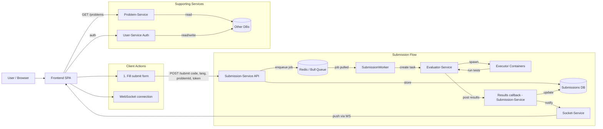

```mermaid
graph LR
    %% Level 2 DFD - Frontend Submission Flow (detailed)

    User[User / Browser]
    Frontend[Frontend SPA]

    subgraph Client[Client Actions]
        Form[1. Fill submit form]
        WS[WebSocket connection]
    end

    subgraph SubmissionPath[Submission Flow]
        API[Submission-Service API]
        SubDB[(Submissions DB)]
        Queue[(Redis / Bull Queue)]
        Worker[SubmissionWorker]
        Evaluator[Evaluator-Service]
        Executor[Executor Containers]
        ResultAPI[Results callback - Submission-Service]
        Notifier[Socket-Service]
    end

    subgraph Support[Supporting Services]
        ProblemSvc[Problem-Service]
        UserSvc[User-Service Auth]
        MainDB[(Other DBs)]
    end

    User --> Frontend
    Frontend --> Form
    Frontend --> WS
    Form -->|POST /submit code, lang, problemId, token| API
    API -->|store| SubDB
    API -->|enqueue job| Queue
    Queue -->|job pulled| Worker
    Worker -->|create task| Evaluator
    Evaluator -->|spawn| Executor
    Executor -->|run tests| Evaluator
    Evaluator -->|post results| ResultAPI
    ResultAPI -->|update| SubDB
    ResultAPI -->|notify| Notifier
    Notifier -->|push via WS| Frontend
    Frontend -->|GET /problems| ProblemSvc
    Frontend -->|auth| UserSvc
    ProblemSvc -->|read| MainDB
    UserSvc -->|read/write| MainDB
```
