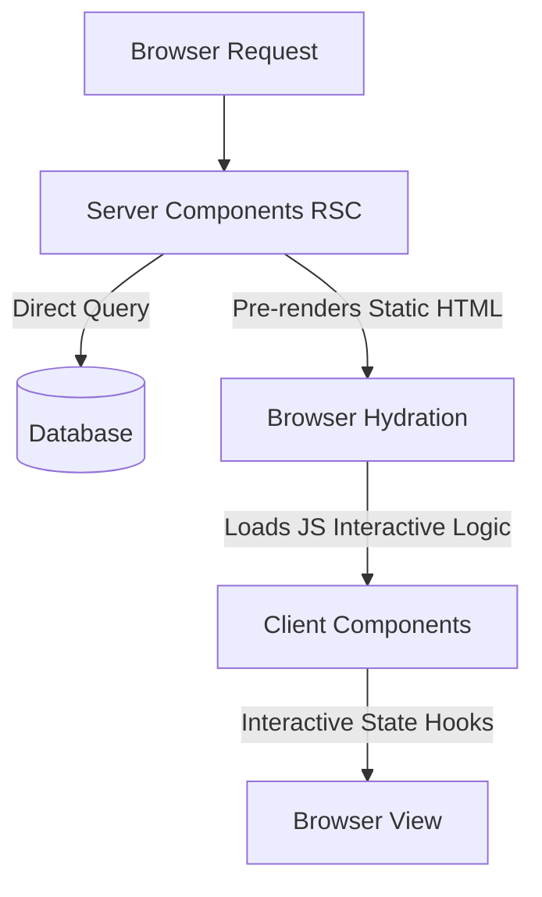
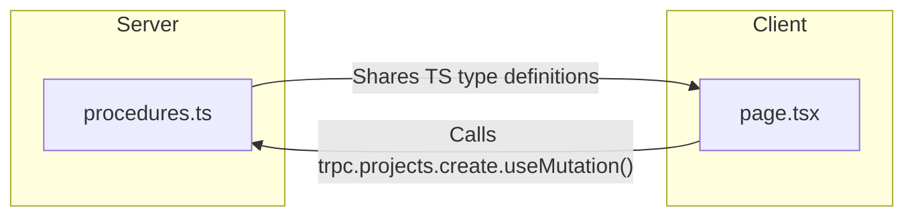
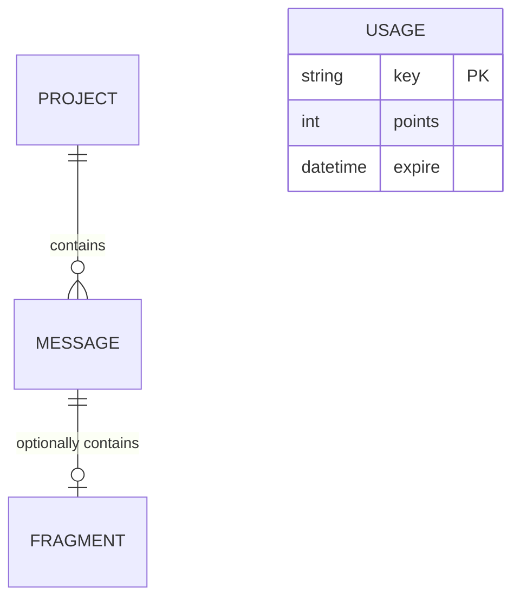
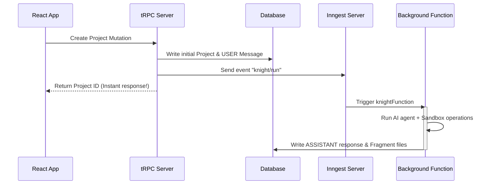
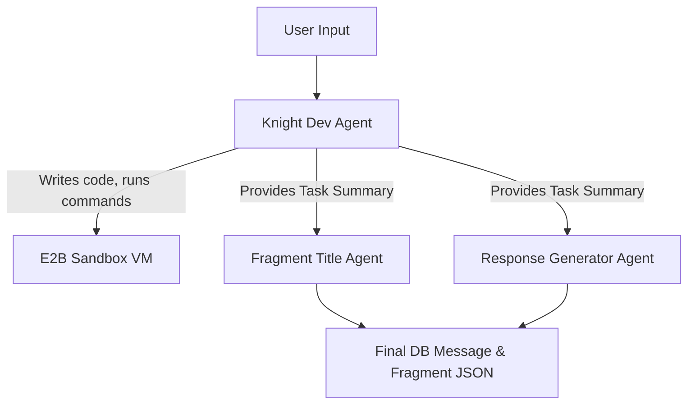
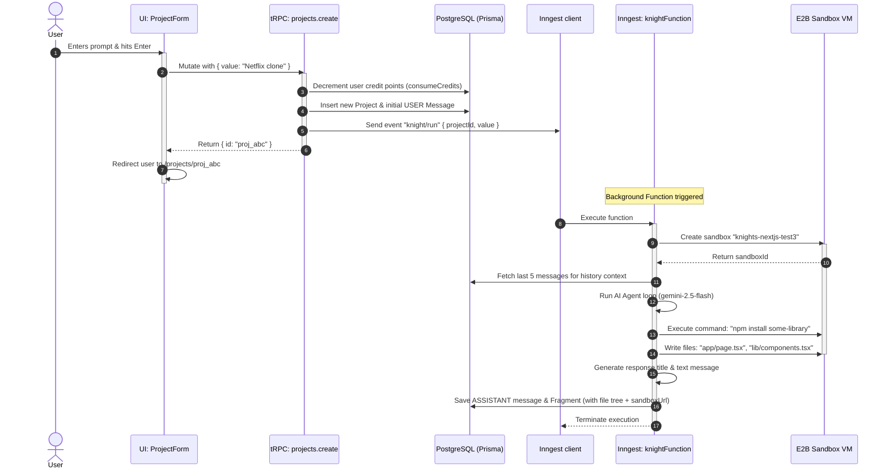
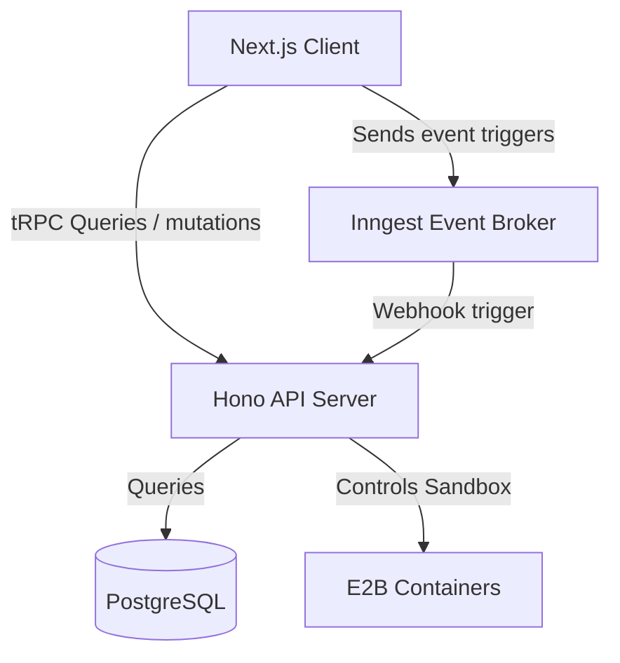

# Knight.dev – The Complete Developer Handbook & Architecture Guide

Welcome! This handbook is designed to take you from a complete beginner to an advanced developer capable of understanding, extending, and maintaining **Knight.dev**. 

If you are unfamiliar with **TypeScript**, **Next.js (App Router)**, **tRPC**, **Prisma ORM**, **Clerk Auth**, **Inngest (Background Workflows)**, or **E2B Sandboxing**, do not worry. This guide covers each technology chapter-by-chapter, explaining the theory first and then looking at the exact files, code, and flows in this project.

---

## Table of Contents
1. [Chapter 1: The Foundations of TypeScript](#chapter-1-the-foundations-of-typescript)
2. [Chapter 2: Next.js 15 & React 19 Essentials](#chapter-2-next-js-15--react-19-essentials)
3. [Chapter 3: tRPC (Type-Safe Remote Procedure Calls)](#chapter-3-trpc-type-safe-remote-procedure-calls)
4. [Chapter 4: Database Design with Prisma ORM](#chapter-4-database-design-with-prisma-orm)
5. [Chapter 5: Authentication & Security with Clerk](#chapter-5-authentication--security-with-clerk)
6. [Chapter 6: Event-Driven Background Jobs with Inngest](#chapter-6-event-driven-background-jobs-with-inngest)
7. [Chapter 7: Sandboxed Code Execution with E2B](#chapter-7-sandboxed-code-execution-with-e2b)
8. [Chapter 8: Multi-Agent Orchestration via Inngest Agent Kit](#chapter-8-multi-agent-orchestration-via-inngest-agent-kit)
9. [Chapter 9: Codebase File Guide & Directory Structure](#chapter-9-codebase-file-guide--directory-structure)
10. [Chapter 10: End-to-End Request Flows](#chapter-10-end-to-end-request-flows)
11. [Chapter 11: Deep-Dive Reference of Every Dependency (The Library Guide)](#chapter-11-deep-dive-reference-of-every-dependency-the-library-guide)
12. [Chapter 12: Architectural Migration: Dedicated Hono Server Backend](#chapter-12-architectural-migration-dedicated-hono-server-backend)
13. [Chapter 13: Project Evolution & Commit-by-Commit Walkthrough](#chapter-13-project-evolution--commit-by-commit-walkthrough)

---

## Chapter 1: The Foundations of TypeScript

### 1.1 What is TypeScript?
JavaScript is a **dynamically typed** language. This means variables can hold any type of data (numbers, strings, objects) and can change types at runtime:
```javascript
let user = "Alice";
user = 42; // Valid JavaScript, but potentially dangerous!
```
If you try to call `user.toUpperCase()` after reassigning it to `42`, your app will crash with `TypeError: user.toUpperCase is not a function`.

**TypeScript** is a typed superset of JavaScript that adds **static typing**. It catches errors *before* your code runs (during compilation/development):
```typescript
let user: string = "Alice";
user = 42; // ❌ Compile-time Error: Type 'number' is not assignable to type 'string'.
```
By adding static typing, TypeScript checks the correctness of your operations during development. This is especially helpful for large codebases where changes in one file could silently break code in another file.

### 1.2 Interfaces, Custom Types, and Generics
In TypeScript, we define the shape of objects using `interface` or `type`.

#### Types and Interfaces
* **Interface**: Best for defining the structure of objects. They can be extended or merged.
* **Type Alias**: Best for union types, primitive aliases, tuples, and complex mappings.

```typescript
// Interface representing a user profile
interface UserProfile {
  id: string;
  name: string;
  isAdmin: boolean;
  email?: string; // Optional field
}

// Extends an existing interface
interface DeveloperProfile extends UserProfile {
  languages: string[];
}

// Type alias representing a status union
type LoadStatus = "idle" | "loading" | "success" | "error";
```

#### Recursive Types
Sometimes, types need to reference themselves. A perfect example is the file directory tree in `src/types.ts`:
```typescript
export type TreeItem = string | [string , ...TreeItem[]];
```
* **Explanation:** A `TreeItem` is either:
  * A `string` (representing a file name, e.g., `"page.tsx"`).
  * An array where the first element is a `string` (the folder name) followed by a list of sub-`TreeItem`s (representing files/folders inside it). This recursive definition allows us to represent folder trees of arbitrary depth (e.g. `["src", ["components", "button.tsx"], "page.tsx"]`).

#### Generics
Generics allow you to write code that works with a variety of types rather than a single one, while maintaining full type safety. Think of it as passing a type as a variable.
```typescript
// A generic box wrapper
interface Box<T> {
  content: T;
}

const stringBox: Box<string> = { content: "Hello" };
const numberBox: Box<number> = { content: 100 };
```
In our codebase, Inngest's `createAgent<AgentState>` uses generics to ensure the agent's memory/state adheres to the custom `AgentState` type we defined:
```typescript
interface AgentState {
  summary: string;
  files: { [path: string]: string };
}
const knight = createAgent<AgentState>({ ... });
```

### 1.3 Asynchronous Code: Promises and `Awaited`
JavaScript runs asynchronously using **Promises** for tasks that take time (e.g., reading a database, hitting an API).

```typescript
// Returns a Promise that will resolve to a string
async function fetchData(): Promise<string> {
  return "Data received";
}

async function main() {
  const result = await fetchData(); // Pauses execution until Promise resolves
  console.log(result); // "Data received"
}
```
The utility helper `Awaited<Type>` unwraps a Promise to get its inner resolved type:
```typescript
type ResolvedData = Awaited<ReturnType<typeof fetchData>>; // Type is 'string'
```
We use this in `src/trpc/init.ts` to determine the exact type of our tRPC server Context:
```typescript
export type Context = Awaited<ReturnType<typeof createTRPCContext>>
```

### 1.4 Runtime Validation with Zod
TypeScript types only exist during development. Once compiled to JavaScript, all type details are stripped. This means if an API endpoint receives invalid JSON at runtime, TypeScript cannot prevent crashes.

**Zod** is a schema validation library that guarantees data is valid at runtime *and* generates TypeScript types automatically:
```typescript
import { z } from "zod";

// 1. Create a validation schema
const projectCreateSchema = z.object({
  value: z.string().min(1, "Message is required").max(1000)
});

// 2. Automatically extract the TypeScript type from the schema
type ProjectCreateInput = z.infer<typeof projectCreateSchema>;

// 3. Validate at runtime
const rawData = { value: "Build a landing page" };
const safeData = projectCreateSchema.parse(rawData); // Throws error if invalid
```
Zod is used extensively in our tRPC procedures (e.g., `src/modules/projects/server/procedures.ts`) to validate inputs sent by the client.

---

## Chapter 2: Next.js 15 & React 19 Essentials

Next.js is a React framework for building full-stack web applications. It handles routing, rendering, build optimizations, and backend API routes.

### 2.1 The App Router and File-Based Routing
Knight.dev uses the **App Router** (`src/app`), where folder layouts map directly to URL paths.

* **Route Groups `(folder)`**: Folders wrapped in parentheses are route groups. They help organize files without affecting the URL route path. For example, `src/app/(home)/page.tsx` maps to the root URL `/`, and `src/app/(home)/pricing/page.tsx` maps to `/pricing`.
* **Dynamic Segments `[folder]`**: Folders wrapped in square brackets define dynamic URL parameters. For instance, `src/app/projects/[projectId]/page.tsx` will catch any URL like `/projects/proj_123` or `/projects/proj_abc`, and the parameter `projectId` will be made available inside the page.

### 2.2 React Server Components (RSC) vs. Client Components
In Next.js, components are divided into two categories:

* **React Server Components (RSC)**: Renders exclusively on the server. They have direct access to database clients, secrets, and local storage on the server. They do not ship any JavaScript to the browser, making them incredibly fast.
* **Client Components**: Declared with the `"use client"` directive at the very top. They compile into JavaScript that is hydrated and executed by the browser. They support interactivity, browser APIs, and state hooks like `useState` or `useEffect`.



#### Example: Hydration & React Query
When a user navigates to `/projects/[projectId]`, we want to load the project from the database *on the server* so it renders instantly, but we also want the browser to start polling for updates (which requires client-side React Query). We achieve this via **Hydration**:

```typescript
// src/app/projects/[projectId]/page.tsx (Server Component)
import { getQueryClient, trpc } from "@/trpc/server";
import { dehydrate, HydrationBoundary } from "@tanstack/react-query";
import { ProjectView } from "@/modules/projects/ui/views/project-view";

const Page = async ({ params }) => {
  const { projectId } = await params;
  const queryClient = getQueryClient();

  // 1. Prefetch query on the server
  await queryClient.prefetchQuery(trpc.projects.getOne.queryOptions({ id: projectId }));

  return (
    // 2. Dehydrate state and pass to client via HydrationBoundary
    <HydrationBoundary state={dehydrate(queryClient)}>
      <ProjectView projectId={projectId} />
    </HydrationBoundary>
  );
};
```
Inside the Client Component (`ProjectView`), calling `useSuspenseQuery(trpc.projects.getOne...)` immediately serves the pre-cached server state without showing a loading spinner on initial page load.

---

## Chapter 3: tRPC (Type-Safe Remote Procedure Calls)

### 3.1 What is tRPC?
In traditional architectures (REST or GraphQL), you build a backend server and write frontend code that calls it via `fetch("/api/projects")`. The frontend doesn't know what types the backend returns unless you write matching TypeScript definitions manually. If you change a backend field name, the frontend breaks silently until runtime.

**tRPC** shares the backend TS types *directly* with the frontend without any build steps or code generation. It makes calling backend code feel like calling a local function, with full autocompletion and compiler safety:



### 3.2 Routers, Procedures, and Context
* **Context (`ctx`)**: Shared data created for *every* request (e.g. current user, database client).
  ```typescript
  // src/trpc/init.ts
  export const createTRPCContext = cache(async () => {
     return { auth: await auth() }; // Clerk authentication details
  });
  ```
* **Procedures**: The actual functions (API endpoints) clients can invoke. They can be:
  * `query`: Read data (maps to `GET`).
  * `mutation`: Write/update data (maps to `POST`/`PUT`/`DELETE`).
* **Router**: A collection of related procedures.
* **Middlewares**: Intercepts requests (e.g. verifying authentication).

```typescript
// Base router setup in src/trpc/init.ts
const t = initTRPC.context<Context>().create({ transformer: superjson });

// Middleware to enforce authentication
const isAuthed = t.middleware(({ next, ctx }) => {
  if (!ctx.auth.userId) {
    throw new TRPCError({ code: "UNAUTHORIZED", message: "Not authenticated" });
  }
  return next({ ctx: { auth: ctx.auth } });
});

export const baseProcedure = t.procedure;
export const protectedProcedure = t.procedure.use(isAuthed); // Enforces login!
```

### 3.3 A Real Procedure in Action
Let's look at `projects.getOne` from `src/modules/projects/server/procedures.ts`:

```typescript
export const projectsRouter = createTRPCRouter({
  getOne: protectedProcedure
    .input(z.object({ id: z.string().min(1) })) // 1. Validate Input shape
    .query(async ({ input, ctx }) => {          // 2. Execute Query
      const project = await prisma.project.findUnique({
        where: {
          id: input.id,
          userId: ctx.auth.userId, // Secure: only fetch projects belonging to this user
        },
      });
      if (!project) throw new TRPCError({ code: "NOT_FOUND" });
      return project; // Returns data with type safety!
    })
});
```

On the frontend (`src/modules/projects/ui/components/project-header.tsx`), calling this is simple:
```typescript
const trpc = useTRPC();
const { data: project } = useSuspenseQuery(
  trpc.projects.getOne.queryOptions({ id: projectId })
);
// 'project' is fully typed as: { id: string; name: string; userId: string; ... }
```

---

## Chapter 4: Database Design with Prisma ORM

### 4.1 What is an ORM?
An **Object-Relational Mapper (ORM)** lets you interact with databases using code objects rather than writing raw SQL queries.

* **Raw SQL:** `SELECT * FROM "Project" WHERE "userId" = '123';`
* **Prisma:** `prisma.project.findMany({ where: { userId: '123' } })`

Prisma uses a schema file (`prisma/schema.prisma`) to configure your database structure, auto-generate migrations, and compile a custom TypeScript client matching your tables.

### 4.2 Schema Analysis (`prisma/schema.prisma`)
Let's inspect the models defined in the database:

```prisma
model Project {
  id        String    @id @default(uuid())
  name      String
  userId    String
  createdAt DateTime  @default(now())
  updatedAt DateTime  @updatedAt
  messages  Message[] // One-to-Many: A project contains multiple chat messages
}

model Message {
  id        String      @id @default(uuid())
  content   String
  role      MessageRole // Enum: USER or ASSISTANT
  type      MessageType // Enum: RESULT or ERROR
  createdAt DateTime    @default(now())
  updatedAt DateTime    @updatedAt
  fragments Fragment?   // One-to-One: A message can have at most one code fragment
  projectId String
  project   Project     @relation(fields: [projectId], references: [id], onDelete: Cascade)
}

model Fragment {
  id         String   @id @default(uuid())
  messageId  String   @unique
  message    Message  @relation(fields: [messageId], references: [id], onDelete: Cascade)
  sandboxUrl String   // Public URL to the E2B sandbox hosting this fragment
  title      String   // Title of the fragment (e.g. "Landing Page")
  files      Json     // JSON tree storing all files created by the agent
  createdAt  DateTime @default(now())
  updatedAt  DateTime @updatedAt
}

model Usage {
  key    String    @id // Holds the user's Clerk ID
  points Int       // Remaining credit tokens
  expire DateTime? // Credit expiration time
}
```

#### Table Relationships Graph


---

## Chapter 5: Authentication & Security with Clerk

Clerk is a developer-friendly service that provides user accounts, login UI widgets, and session management.

### 5.1 Protecting Routes with Middleware
To prevent unauthenticated users from accessing project workspaces, `src/middleware.ts` intercepts requests:

```typescript
import { clerkMiddleware, createRouteMatcher } from "@clerk/nextjs/server"

// 1. Define routes that can be loaded without logging in
const isPublicRoute = createRouteMatcher([
  '/sign-in(.*)',
  '/',
  '/api/inngest(.*)',
  '/sign-up(.*)',
  '/projects(.*)',
  '/pricing(.*)'
])

// 2. If a route isn't public, verify authentication. Redirect to login if needed.
export default clerkMiddleware(async (auth, req) => {
  if (!isPublicRoute(req)) {
    await auth.protect()
  }
})
```

### 5.2 Checking Credits & Subscriptions
In `src/lib/usage.ts`, we check if the user is a `pro` member using Clerk's `auth()` helper to determine credit limits:
```typescript
export async function getUsageTracker() {
  const { has } = await auth();
  const hasPremiumAccess = has({ plan: "pro" }); // Check Clerk subscription plan

  return new RateLimiterPrisma({
    storeClient: prisma,
    tableName: "Usage",
    points: hasPremiumAccess ? 300000 : 150, // 300k credits for pro, 150 for free
    duration: 30 * 24 * 60 * 60, // 30 days
  });
}
```

---

## Chapter 6: Event-Driven Background Jobs with Inngest

Building an app with AI is slow: invoking models, booting sandbox execution instances, and generating code takes seconds to minutes. If we ran this inside a standard HTTP server request, the connection would time out.

**Inngest** solves this by providing a background event queue. Instead of executing the AI agent immediately, we send a `"knight/run"` event to Inngest and finish the HTTP request right away. Inngest then triggers our background function asynchronously, handles automatic retries, and monitors execution.



### 6.1 Steps and Durable Execution
Standard serverless functions have execution time limits (e.g. 10 seconds). Inngest achieves "Durable Execution" by breaking functions into **Steps** via `step.run`. 

If a step takes too long or fails, Inngest pauses the execution and retries that specific step without running the preceding steps again:

```typescript
// src/inngest/functions.ts
export const knightFunction = inngest.createFunction(
  { id: "knight" },
  { event: "knight/run" },
  async ({ event, step }) => {
    
    // Step 1: Create the sandbox container. Cached if function retries.
    const sandboxId = await step.run("get-sandbox-id", async () => {
      const sandbox = await Sandbox.create("knights-nextjs-test3");
      return sandbox.sandboxId;
    });

    // Step 2: Fetch previous messages from DB
    const previousMessages = await step.run("get-previous-messages", async () => {
      return prisma.message.findMany({ where: { projectId: event.data.projectId } });
    });

    // ... run agent logic ...
  }
);
```

---

## Chapter 7: Sandboxed Code Execution with E2B

### 7.1 What is E2B?
When you ask Knight.dev to write an application, the AI code isn't just displayed as text. We spin up a fully isolated, secure Linux micro-virtual machine (VM) in the cloud for that project. This container holds a running development server (a Next.js app) listening on port 3000.

**E2B** (Equivalent to Browser) is the infrastructure provider we use to spawn these sandboxes.

### 7.2 Custom Sandbox Templates
The folder `sandbox-templates/nextjs/` contains configuration files to bootstrap our container:
* `e2b.toml`: Defines the sandbox template configuration.
* `Dockerfile`: Installs Node.js, packages, and initializes a Next.js environment.
* `compile_page.sh`: A shell script inside the VM that copies compiled styles and prepares the environment.

### 7.3 Interacting with the Sandbox
In `src/inngest/functions.ts`, we give our AI agent tools to control the VM using the E2B SDK:

```typescript
// 1. Run terminal commands in the VM
const result = await sandbox.commands.run("npm install lucide-react --yes");

// 2. Write code files inside the VM (triggers Next.js hot-reloading!)
await sandbox.files.write("app/page.tsx", "use client;\nexport default function Page() { ... }");

// 3. Read files from the VM
const content = await sandbox.files.read("app/page.tsx");
```

---

## Chapter 8: Multi-Agent Orchestration via Inngest Agent Kit

To solve complex engineering tasks, we use a multi-agent framework called **@inngest/agent-kit**. Rather than relying on a single prompt, we build a network of specialized agents.



### 8.1 The "Knight" Coding Agent
This is the core engineer agent. It is configured in `src/inngest/functions.ts`:
```typescript
const knight = createAgent<AgentState>({
  name: "knight",
  system: dev_prompt, // Highly detailed system engineering instructions
  model: gemini({
    model: "gemini-2.5-flash",
    apiKey: process.env.GEMINI_API_KEY
  }),
  tools: [TerminalTool, createOrUpdateFilesTool, readFilesTool]
});
```

### 8.2 State Management & Agent Cooperation
As the agent executes tools (e.g. writing a file), it updates its memory state:
```typescript
interface AgentState {
  summary: string;                  // A text summary explaining the work done
  files: { [path: string]: string }; // Tracks path-to-content map of all created files
}
```

The execution loop runs inside a `network`:
```typescript
const network = createNetwork<AgentState>({
  name: "code-agency",
  agents: [knight],
  maxIter: 4, // Max iterations of planning, tool-calling, and reasoning
  defaultState: state,
  router: async ({ network }) => {
    // If the agent populated the 'summary' field (completed the task), terminate the loop.
    if (network.state.data.summary) return;
    return knight; // Otherwise, hand control back to the knight agent.
  },
});

const result = await network.run(event.data.value, { state });
```

### 8.3 Post-Processing Agents
Once the coding agent finishes and provides a `summary`, we spawn two quick-running utility agents to format the output:
1. **Fragment Title Generator (`src/prompt/prompt.ts#FRAGMENT_TITLE_PROMPT`)**: Reads the summary and returns a clean 2-3 word title (e.g., `"Landing Page"`).
2. **Response Generator (`src/prompt/prompt.ts#RESPONSE_PROMPT`)**: Reads the summary and writes a friendly conversational response for the user interface (e.g., `"Here's the Netflix-style homepage with a dark theme and working video cards."`).

---

## Chapter 9: Codebase File Guide & Directory Structure

Here is a guide to where everything is, so you know exactly which files to edit when changing features:

### 9.1 Root Configuration Files
* `/package.json`: Manages external packages and dev scripts (`npm run dev`).
* `/tsconfig.json`: Configuration settings for the TypeScript compiler.
* `/postcss.config.mjs` & `/components.json`: Style configurations for Tailwind and Shadcn UI.
* `/prisma/schema.prisma`: The database structure configuration.

### 9.2 Source Directory (`src/`)
* **`/src/app/` (Routing and Handlers):**
  * `layout.tsx`: Mounts providers for Clerk auth, Theme context, and tRPC query providers.
  * `(home)/page.tsx`: Renders the main dashboard workspace.
  * `projects/[projectId]/page.tsx`: Workspace for code fragments. Uses SSR hydration to load databases early.
  * `api/trpc/[trpc]/route.ts`: Maps incoming tRPC calls to backend files.
  * `api/inngest/route.ts`: The HTTP webhook handler for background events.
* **`/src/components/` (Shared UI Elements):**
  * `file-explorer.tsx`: Left sidebar containing folder trees and code preview tabs.
  * `tree-view.tsx`: Recursive widget rendering nested folders.
  * `hint.tsx`: Wrapper adding hover tooltips.
  * `code-view/`: Prism syntax highlighter component.
  * `ui/`: Standard reusable design components (buttons, dialogs, tabs).
* **`/src/modules/` (Feature Modules):**
  Instead of grouping by component type, code is grouped by feature domains:
  * **`home/`**:
    * `ui/components/project-form.tsx`: Text input area on the homepage for creating workspaces.
    * `ui/components/project-list.tsx`: Grid showing previously created user directories.
  * **`projects/`**:
    * `ui/views/project-view.tsx`: The primary split-screen panel (chat on the left, iframe preview/code on the right).
    * `ui/components/message-container.tsx`: List of chat cards that polls the database every 2 seconds for live updates.
    * `ui/components/fragment-web.tsx`: Frame hosting the sandbox URL iframe, plus buttons to copy/open sandbox URLs.
    * `server/procedures.ts`: The tRPC queries to fetch individual project workspaces.
  * **`messages/`**:
    * `server/procedures.ts`: The tRPC endpoint to insert user prompts and invoke background jobs.
  * **`usage/`**:
    * `server/procedures.ts`: Procedures to track user tokens.
* **`/src/inngest/` (Event Listeners & Workers):**
  * `client.ts`: Exposes the Inngest runner.
  * `functions.ts`: Spawns the sandbox VM, triggers Gemini models, and writes changes back to PostgreSQL.
  * `utils.ts`: Sandbox helpers.

---

## Chapter 10: End-to-End Request Flows

Let's follow the data path for two essential workflows to understand how these technologies work together.

### Flow 1: Creating a Project (Project Bootstrap)



### Flow 2: Live Updates & Chat Progression

Once the project page `/projects/proj_abc` loads, the user waits for the agent to finish. Here is how the UI updates in real time:

1. **Polling (`useSuspenseQuery`)**:
   Every 2 seconds, the client-side `<MessageContainer>` calls `trpc.messages.getMany({ projectId })`.
2. **Showing Loader**:
   While the agent runs in the background, the last message in the database is the `USER` message. The UI sees this and displays the bouncing dots animation (`<MessageLoading />`).
3. **Completing execution**:
   When the background worker saves the `ASSISTANT` message and `Fragment` to PostgreSQL, the next 2-second poll receives this new message.
4. **Hydrating Fragment**:
   The `<MessageContainer>` detects the new ASSISTANT message, extracts the `Fragment` object, and calls `setActiveFragment(message.fragments)`.
5. **Displaying Iframe**:
   The right-hand panel mounts `<FragmentPreview>` with the E2B URL (e.g. `https://<sandbox-id>-3000.e2b.dev`). The browser loads the iframe, which connects to the running Next.js dev server inside the secure VM, rendering the generated app instantly!
6. **Further Chat**:
   If the user submits a new prompt inside the project page, `messages.create` is triggered. It saves the message, runs the same Inngest event, updates files in the *same* sandbox, and hot-reloads the changes directly inside the iframe!

---

## Chapter 11: Deep-Dive Reference of Every Dependency (The Library Guide)

Below is an exhaustive explanation of every direct dependency in `package.json`. It covers why each is used, how it works, and its role in the project.

### 11.1 Core Application Framework
* **`next` (v15.4.6) & `react` / `react-dom` (v19.1.0)**
  * **What it is:** Next.js is the full-stack meta-framework. React 19 is the underlying UI library.
  * **Usage in Project:** Serves the root layout, routes, and provides the App Router framework. React 19 features like Server Components are utilized to prefetch project details securely on the server.
* **`typescript` (v5.x)**
  * **What it is:** The compiler that adds static types to our JavaScript.
  * **Usage in Project:** Enforces codebase type safety, recursive folder paths structure representation (`TreeItem`), and auto-completes tRPC procedures.

### 11.2 API & Server Communication Layer
* **`@trpc/server`, `@trpc/client`, `@trpc/tanstack-react-query` (v11.4.4)**
  * **What it is:** End-to-end type safety wrapper. Translates your backend procedures into autocomplete-friendly hooks on the client.
  * **Usage in Project:** Found in `src/trpc/`. Integrates backend routers in `src/modules/*/server/procedures.ts` with React query clients on the frontend.
* **`@tanstack/react-query` (v5.85.3)**
  * **What it is:** A state-management library specifically for server data (caching, polling, and invalidating database calls).
  * **Usage in Project:** Powering the `refetchInterval: 2000` polling inside `<MessageContainer>` to query the database every 2 seconds for new messages from the Inngest worker.
* **`superjson` (v2.2.2)**
  * **What it is:** A custom serializer that allows sending data types that aren't natively supported by standard JSON (like `Date`, `Map`, `Set`, and `BigInt`) over HTTP requests.
  * **Usage in Project:** Set up as the transformer in both the tRPC client and server (`src/trpc/init.ts`). This is why we can query a project's `updatedAt` Date object directly from tRPC without having to manually convert it to a string.

### 11.3 Database & Data Persistence
* **`prisma` & `@prisma/client` (v6.14.0)**
  * **What it is:** A production-grade database toolkit and ORM.
  * **Usage in Project:** Defined in `prisma/schema.prisma` and instantiated in `src/lib/db.ts`. Handles all queries to Postgres for Projects, Messages, and Credits status.
* **`drizzle-orm` (v0.44.5)**
  * **Note:** While installed in `package.json`, the project currently uses **Prisma exclusively** for its database layer. Drizzle remains unused in the `src/` codebase.

### 11.4 Authentication & Identity Management
* **`@clerk/nextjs` (v6.31.6) & `@clerk/themes` (v2.4.15)**
  * **What it is:** Authentication-as-a-service providing middleware, context providers, and premade UI blocks (login boxes).
  * **Usage in Project:** Wraps the entire layout in `src/app/layout.tsx`. Restricts API access via `src/middleware.ts` and authenticates tRPC connections in `src/trpc/init.ts`.

### 11.5 Background Worker & AI Agent Orchestration
* **`inngest` (v3.40.1)**
  * **What it is:** A serverless event broker and queue.
  * **Usage in Project:** Receives the `"knight/run"` event trigger, boots background tasks safely, and ensures long-running agent logic executes durably.
* **`@inngest/agent-kit` (v0.9.0)**
  * **What it is:** A framework for orchestrating AI Agents, networks, and tool executions.
  * **Usage in Project:** Orchestrates our Gemini AI agents in `src/inngest/functions.ts` by managing state (created files, task summary), selecting tools (Terminal, Read/Write files), and executing multiple model runs in a network.

### 11.6 Code Sandboxing
* **`@e2b/code-interpreter` (v2.0.0)**
  * **What it is:** SDK to create and interact with secure, isolated sandboxes (mini virtual machines).
  * **Usage in Project:** Instantiated in `src/inngest/functions.ts` using the template `knights-nextjs-test3` to run a hot-reloading Next.js dev server where the AI agent installs packages and edits files.

### 11.7 Form Processing & Schema Checking
* **`zod` (v4.1.1)**
  * **What it is:** Runtime schema validation and TypeScript type generation.
  * **Usage in Project:** Validates user prompts in forms and guarantees input types in tRPC procedures.
* **`react-hook-form` (v7.62.0) & `@hookform/resolvers` (v5.2.1)**
  * **What it is:** React Hook Form manages inputs, errors, and validation state without re-rendering the whole page. The resolvers package connects it directly to Zod.
  * **Usage in Project:** Handles text inputs inside `ProjectForm` and `MessageForm`.

### 11.8 UI Styles & Visual Primitives
* **`tailwindcss` (v4.x) & `@tailwindcss/postcss`**
  * **What it is:** Utility-first styling framework. Version 4 compiles modern CSS styles using a lightning-fast engine.
  * **Usage in Project:** Handles 100% of the styling.
* **`class-variance-authority` (v0.7.1)**
  * **What it is:** A utility to create complex component variant definitions (like buttons with sizes `sm`/`lg` and colors `primary`/`ghost`).
  * **Usage in Project:** Defines component variants inside `src/components/ui/button.tsx`.
* **`clsx` (v2.1.1) & `tailwind-merge` (v3.3.1)**
  * **What it is:** `clsx` merges conditional class names. `tailwind-merge` resolves conflicts (e.g. if you write `px-4 px-2`, it outputs `px-2`).
  * **Usage in Project:** Combined in the `cn(...)` utility function in `src/lib/utils.ts` to make dynamic styling clean and safe.
* **`@radix-ui/react-*` (e.g., dropdown, tabs, resizable, dialog)**
  * **What it is:** A set of accessible, unstyled UI primitives.
  * **Usage in Project:** Forms the underlying structure of our Shadcn components (buttons, split-screens, tabs).
* **`lucide-react` (v0.539.0)**
  * **What it is:** A collection of clean, open-source SVG icons.
  * **Usage in Project:** Renders symbols like `EyeIcon`, `CodeIcon`, and `RefreshCcwIcon`.
* **`next-themes` (v0.4.6)**
  * **What it is:** Handles dark mode and light mode switching in Next.js apps.
  * **Usage in Project:** Saves user color scheme choices and toggles classes on the `<html>` element.

### 11.9 Specialized Utility Libraries
* **`rate-limiter-flexible` (v7.2.0)**
  * **What it is:** Rate limiting library supporting different database backends.
  * **Usage in Project:** Restricts credits usage. Integrates with the Prisma client in `src/lib/usage.ts` to query and save usage limits.
* **`prismjs` (v1.30.0)**
  * **What it is:** A syntax highlighter library.
  * **Usage in Project:** Dynamically highlights TypeScript/JSX/JSON code strings inside `<CodeView>` with proper token colors.
* **`random-word-slugs` (v0.1.7)**
  * **What it is:** Generates readable random word combinations.
  * **Usage in Project:** Automatically names newly created projects (e.g. `"happy-dragon"`) in the create procedure.
* **`date-fns` (v4.1.0)**
  * **What it is:** Date formatting utility.
  * **Usage in Project:** Formats time relative to now (e.g. `"5 minutes ago"`) in the projects dashboard view.
* **`recharts` (v2.15.4)**
  * **What it is:** Charts library built on D3 and React.
  * **Usage in Project:** Used to display usage metrics and point consumption in the UI.
* **`embla-carousel-react` (v8.6.0)**
  * **What it is:** Carousel rendering engine.
  * **Usage in Project:** Powering swipeable previews and templates selectors.
* **`cmdk` (v1.1.1)**
  * **What it is:** A fast, accessible command menu dialog.
  * **Usage in Project:** Powering command selectors and quick file searches.
* **`vaul` (v1.1.2)**
  * **What it is:** An drawer component for mobile overlay drawers.
  * **Usage in Project:** Bottom drawers on mobile views.
* **`input-otp` (v1.4.2)**
  * **What it is:** OTP input component.
  * **Usage in Project:** Used during signup verification.
* **`react-error-boundary` (v6.0.0)**
  * **What it is:** Catches JavaScript errors in client components to display fallback screens instead of crashing the site.
  * **Usage in Project:** Catches render failures and provides recovery states.

---

## Chapter 12: Architectural Migration: Dedicated Hono Server Backend

To run tRPC and Inngest on a separate backend server (for instance, to host it on Cloudflare Workers, Bun, or a dedicated Node.js service) while keeping Next.js strictly for the frontend, we use **Hono**. Hono is a fast, lightweight, standard-compliant router that natively supports Fetch API `Request` and `Response` objects.



Here is the step-by-step implementation guide to achieve this migration.

### 12.1 Directory Structure
On the separate backend codebase (e.g. `/backend`), you would structure it like this:
```text
backend/
  ├── package.json
  ├── tsconfig.json
  ├── src/
  │     ├── index.ts          (Hono Server Entrypoint)
  │     ├── db.ts             (Prisma Client Instantiation)
  │     ├── trpc/
  │     │     ├── init.ts     (tRPC Server Initialization & Context)
  │     │     └── router.ts   (App Router Composition)
  │     └── inngest/
  │           ├── client.ts   (Inngest client instance)
  │           └── functions.ts (Durable Knight Background Function)
  └── prisma/
        └── schema.prisma     (Copy of Prisma schema)
```

### 12.2 Setting up Hono dependencies
Your backend `package.json` will need these dependencies:
```json
{
  "dependencies": {
    "@clerk/backend": "^1.24.0",
    "@hono/node-server": "^1.13.7",
    "@inngest/agent-kit": "^0.9.0",
    "@prisma/client": "^6.14.0",
    "@trpc/server": "^11.4.4",
    "hono": "^4.6.14",
    "inngest": "^3.40.1",
    "superjson": "^2.2.2",
    "zod": "^4.1.1"
  }
}
```

### 12.3 Hono Server Entrypoint (`src/index.ts`)
We instantiate Hono, configure CORS so our Next.js frontend (on `localhost:3000`) can connect, and mount our endpoints:

```typescript
import { Hono } from "hono";
import { cors } from "hono/cors";
import { serve } from "@hono/node-server";
import { fetchRequestHandler } from "@trpc/server/adapters/fetch";
import { serve as serveInngest } from "inngest/hono";

import { appRouter } from "./trpc/router";
import { createTRPCContext } from "./trpc/init";
import { inngest } from "./inngest/client";
import { knightFunction } from "./inngest/functions";

const app = new Hono();

// 1. Enable CORS for Frontend communication
app.use(
  "/*",
  cors({
    origin: ["http://localhost:3000", "https://knight.dev"],
    allowHeaders: ["Content-Type", "Authorization", "x-trpc-source"],
    allowMethods: ["GET", "POST", "PUT", "OPTIONS"],
    exposeHeaders: ["Content-Length"],
    credentials: true,
  })
);

// 2. Mount tRPC API Endpoint using Fetch Request Handler
app.all("/trpc/*", async (c) => {
  return fetchRequestHandler({
    endpoint: "/trpc",
    req: c.req.raw,
    router: appRouter,
    createContext: async () => createTRPCContext(c), // Pass Hono context
  });
});

// 3. Mount Inngest API Event Webhook using Hono Adapter
app.use(
  "/api/inngest",
  serveInngest({
    client: inngest,
    functions: [knightFunction],
  })
);

console.log("Hono backend server running on port 8000...");
serve({
  fetch: app.fetch,
  port: 8000,
});
```

### 12.4 Verification of Clerk Auth on Hono
Since Clerk is running on a separate backend, we cannot use `@clerk/nextjs/server`'s `auth()` helper directly because Hono is outside Next.js's middleware stack. 

Instead, we use `@clerk/backend` to verify the JWT session token passed in the `Authorization` header:

```typescript
// src/trpc/init.ts
import { initTRPC, TRPCError } from "@trpc/server";
import { createClerkClient } from "@clerk/backend";
import { Context as HonoContext } from "hono";
import superjson from "superjson";

const clerkClient = createClerkClient({
  secretKey: process.env.CLERK_SECRET_KEY,
});

export const createTRPCContext = async (c: HonoContext) => {
  const authHeader = c.req.header("Authorization");
  let userId: string | null = null;

  if (authHeader?.startsWith("Bearer ")) {
    try {
      const token = authHeader.split(" ")[1];
      const verifiedToken = await clerkClient.authenticateRequest(c.req.raw, {
        jwtKey: process.env.CLERK_JWT_KEY,
      });
      if (verifiedToken.isSignedIn) {
        userId = verifiedToken.toAuth().userId;
      }
    } catch (e) {
      console.error("Token verification failed:", e);
    }
  }

  return {
    userId,
  };
};

export type Context = Awaited<ReturnType<typeof createTRPCContext>>;

const t = initTRPC.context<Context>().create({
  transformer: superjson,
});

// Protected procedure middleware checking the verified userId
const isAuthed = t.middleware(({ next, ctx }) => {
  if (!ctx.userId) {
    throw new TRPCError({
      code: "UNAUTHORIZED",
      message: "User not authenticated",
    });
  }
  return next({
    ctx: {
      userId: ctx.userId,
    },
  });
});

export const createTRPCRouter = t.router;
export const protectedProcedure = t.procedure.use(isAuthed);
export const baseProcedure = t.procedure;
```

### 12.5 Adjusting Frontend Config (`src/trpc/client.tsx`)
In your Next.js application, update `getUrl()` to point to the new dedicated Hono API endpoint, and include the authentication token in headers:

```typescript
// src/trpc/client.tsx (Fragment)
import { useAuth } from "@clerk/nextjs";

function getUrl() {
  // Point to the dedicated Hono server port
  return process.env.NEXT_PUBLIC_BACKEND_URL || "http://localhost:8000/trpc";
}

// Inside TRPCReactProvider, we inject Clerk session tokens into headers
export function TRPCReactProvider(props: { children: React.ReactNode }) {
  const queryClient = getQueryClient();
  const { getToken } = useAuth(); // Clerk client-side token retriever

  const [trpcClient] = useState(() =>
    createTRPCClient<AppRouter>({
      links: [
        httpBatchLink({
          transformer: superjson,
          url: getUrl(),
          async headers() {
            const token = await getToken(); // Gets current signed session token
            return {
              Authorization: token ? `Bearer ${token}` : "",
            };
          },
        }),
      ],
    })
  );

  return (
    <QueryClientProvider client={queryClient}>
      <TRPCProvider trpcClient={trpcClient} queryClient={queryClient}>
        {props.children}
      </TRPCProvider>
    </QueryClientProvider>
  );
}
```

---

## Chapter 13: Project Evolution & Commit-by-Commit Walkthrough

Analyzing how a codebase is built step-by-step provides the deepest understanding of its architecture. This chapter tracks the evolution of the **Knight.dev** repository from its initial setup to its completed production state, matching the actual project commit history.

### 13.1 Phase 1: Core Framework & tRPC API Boilerplate
* **Commits:** `3e5e5db` (Initial Next App) $\rightarrow$ `00db6cf` (tRPC Setup) $\rightarrow$ `9ec5f90` (tRPC client prefetching)
* **What was built:** 
  - Bootstrapped Next.js 15 inside TypeScript.
  - Set up the server-side tRPC context and route configuration (`src/app/api/trpc/[trpc]/route.ts`).
  - Added the `@tanstack/react-query` wrapper client (`src/trpc/client.tsx`) to support typesafe client hooks.
* **Why it was built this way:** Initializing the type-safety contract (tRPC) first ensures that as components and database tables are added, the compiler can catch API shape changes instantly.

### 13.2 Phase 2: Background Task Queue & E2B Code Isolation
* **Commits:** `d484a33` (Inngest integration) $\rightarrow$ `def4aaa` (Inngest Agent Kit) $\rightarrow$ `df08178` (E2B VM Template) $\rightarrow$ `99fdfc7` (E2B Terminal tools)
* **What was built:**
  - Integrated the **Inngest event client** to handle background workflows out-of-band.
  - Setup the Inngest Agent Kit framework with a single `helloWorld` background agent function.
  - Added the **E2B sandbox template configuration** (`sandbox-templates/nextjs/e2b.toml` and `Dockerfile`) to specify the guest container OS.
  - Built E2B terminal tools, enabling the background agent to run shell commands (`npm install`, `npm run dev`) inside the virtual machine.
* **Why it was built this way:** This decoupled execution. By moving task running outside the synchronous Next.js request/response thread, the application avoids timeout failures.

### 13.3 Phase 3: Prisma Relational Database Schema Design
* **Commits:** `6de52b4` (Prisma Models) $\rightarrow$ `42df067` (Project creation procedures)
* **What was built:**
  - Configured the SQLite/PostgreSQL models in `schema.prisma` mapping `Project`, `Message`, and `Fragment`.
  - Wrote tRPC procedures to handle project initialization, incorporating `random-word-slugs` to automatically title unnamed project environments.
  - Bound the database write queries with `inngest.send` event triggers so that project instantiation automatically dispatches the worker function.

### 13.4 Phase 4: UI Shell & Code Viewer Workspace
* **Commits:** `2013c76` (Message inputs) $\rightarrow$ `0b27314` (Workspace views & skeletons) $\rightarrow$ `ed0d3d8` (Iframe tooltips) $\rightarrow$ `41d0d93` (PrismJS editor & file explorer) $\rightarrow$ `cced682` (Sidebar grids & templates selection)
* **What was built:**
  - Built `<MessageContainer>` and `<MessageCard>` with state indicators showing dynamic loader loops.
  - Mounted `<FragmentPreview>` hosting an iframe displaying the running E2B sandbox application.
  - Integrated **PrismJS** with the `<CodeView>` component to display file contents with syntax colors.
  - Built the recursive `<FileExplorer>` layout, letting users select and copy files from the generated project hierarchy.
  - Developed the dashboard templates grid, letting users kickstart projects using preconfigured framework examples.

### 13.5 Phase 5: Clerk Authentication & Token usage Controls
* **Commits:** `928f457` (SignIn/SignUp components) $\rightarrow$ `13c7ba9` (Rate limiting & credits) $\rightarrow$ `028e57b` (Pro Access checks)
* **What was built:**
  - Mounted Clerk widgets, protecting API endpoints using Clerk middleware router matches.
  - Added the `Usage` table to database storage.
  - Integrated `rate-limiter-flexible` inside a server procedures helper (`src/lib/usage.ts`) to count points and block users who run out of free credits.
  - Enhanced the frontend header panels to display remaining point balances.

### 13.6 Phase 6: Post-Processing Agents & Performance Optimizations
* **Commits:** `cbbbd04` (Response & Title agents) $\rightarrow$ `20146b8` (Error boundaries) $\rightarrow$ `8bb87e7` (E2B HTTPS switch) $\rightarrow$ `1c5279e` (Workspace refinement)
* **What was built:**
  - Added post-processing agent chains inside `knightFunction` using Gemini models to format final message copy and generate clean titles.
  - Created customized error landing pages with retry controls.
  - Switched the E2B client preview url endpoints from `HTTP` to `HTTPS` to avoid browser mixed-content blocks when running iframe previews.
  - Set the background orchestrator iterations to a maximum of 4 steps (`maxIter: 4`) to balance task completion rates with runtime token cost.
