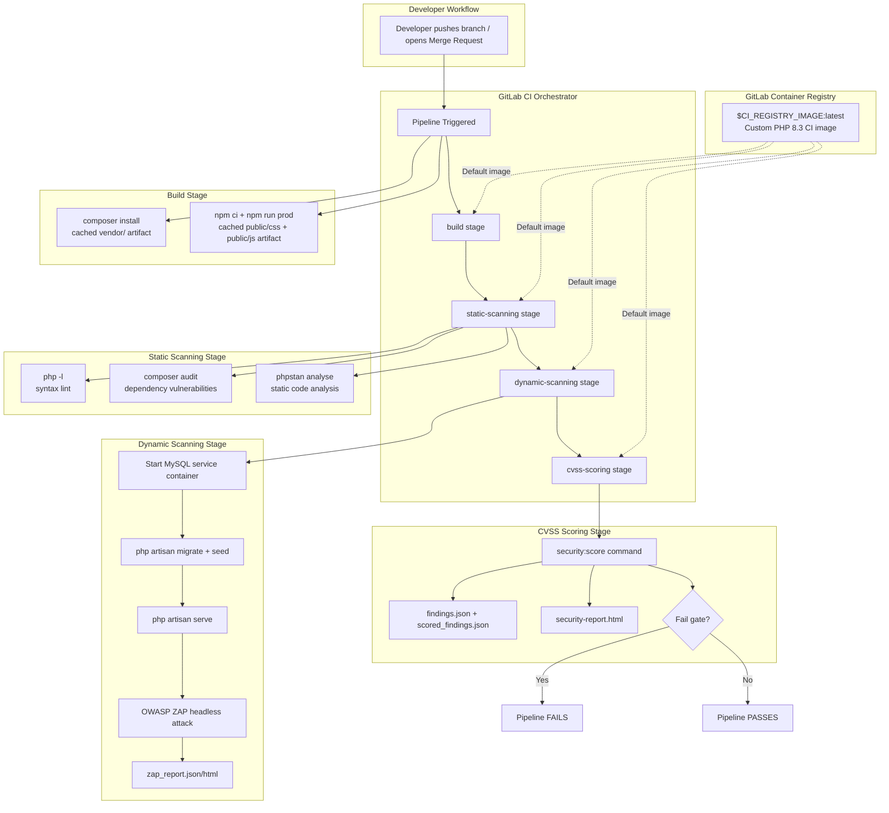
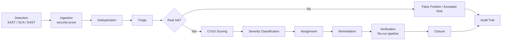
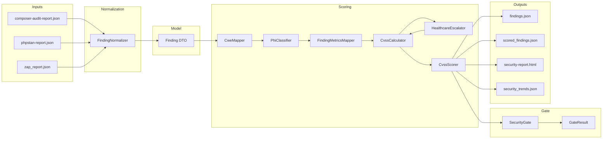

# LibreHealth EHR — CI/CD Pipeline Architecture (In-Depth)

> **Scope:** This document explains the complete Continuous Integration / Continuous Delivery (CI/CD) architecture for the LibreHealth EHR Laravel application, including how Docker is used in every stage, how code moves from a developer's branch to a deployable artifact, and how security gates are enforced.

---

## 1. Executive Summary

This project uses **GitLab CI** as the CI/CD orchestrator and **Docker** as the execution environment. The pipeline is defined in `.gitlab-ci.yml` and uses a custom image built from `Dockerfile.ci`. The pipeline has four stages:

1. **build** — Install PHP dependencies and compile frontend assets.
2. **static-scanning** — Lint PHP, audit Composer packages, and run Larastan static analysis.
3. **dynamic-scanning** — Start the application and run OWASP ZAP against it.
4. **cvss-scoring** — Aggregate all security findings, score them, and fail the pipeline if a risk gate is breached.

**StyleCI** runs in parallel for automatic code-style checks.

The pipeline produces:

* A cached Docker image (`$CI_REGISTRY_IMAGE:latest`).
* A `vendor/` artifact.
* Compiled frontend assets (`public/css`, `public/js`, `public/mix-manifest.json`).
* Security reports (`composer-audit-report.json`, `phpstan-report.json`, `zap_report.*`, `findings.json`, `scored_findings.json`, `security-report.html`).

---

## 2. High-Level Architecture Diagram



> **Rendered PNG:** A rendered version of this diagram is available at [`docs/CI_CD_ARCHITECTURE_DIAGRAM.png`](docs/CI_CD_ARCHITECTURE_DIAGRAM.png). The editable source is at [`docs/CI_CD_ARCHITECTURE_DIAGRAM.mmd`](docs/CI_CD_ARCHITECTURE_DIAGRAM.mmd).

---

## 3. What Is CI/CD Here?

### 3.1 Continuous Integration (CI)

Every time a developer pushes code or opens a Merge Request (MR), GitLab CI automatically:

* Builds the application.
* Runs syntax checks.
* Audits dependencies for known vulnerabilities.
* Runs static analysis (Larastan).
* Runs dynamic security tests (OWASP ZAP).
* Scores and gates all findings.

If any required job fails, the MR cannot be merged (assuming branch protection rules are enabled).

### 3.2 Continuous Delivery (CD) — Foundation

This repository currently focuses on **CI + security gating**. The CD part (deployment to staging/production) would be added as additional stages such as:

```yaml
stages:
  - build
  - static-scanning
  - dynamic-scanning
  - cvss-scoring
  - deploy-staging
  - deploy-production
```

The existing pipeline already produces all artifacts needed for CD: vendor dependencies, compiled assets, and a verified Docker image.

---

## 4. Pipeline Trigger Rules

The pipeline starts under these conditions (from `.gitlab-ci.yml`):

```yaml
workflow:
  rules:
    - if: $CI_PIPELINE_SOURCE == "merge_request_event"
    - if: $CI_COMMIT_BRANCH && $CI_OPEN_MERGE_REQUESTS
      when: never
    - if: $CI_COMMIT_BRANCH
```

**Rule-by-rule meaning:**

1. **Merge Request Event** — Always create a pipeline when an MR is opened or updated. This is the primary CI path.
2. **Skip duplicate branch pipeline** — If a branch already has an open MR, do **not** also run a branch pipeline. This prevents double builds.
3. **Any branch push** — Run a pipeline when code is pushed to any branch (but only if no MR is open).

---

## 5. Docker Architecture In-Depth

### 5.1 Why Docker?

Docker guarantees that every pipeline job runs in the **same environment** regardless of which GitLab runner executes it. Without Docker, runners could have different PHP versions, missing extensions, or different Node.js versions, causing "works on my machine" failures.

### 5.2 Dockerfile.ci — Multi-Stage Build

The `Dockerfile.ci` uses a **multi-stage build** with three targets:

```dockerfile
FROM php:8.3-cli AS base
# ... install PHP extensions + Composer

FROM php:8.3-cli AS runtime
# ... lightweight production-like image

FROM base AS ci
# ... install extra CI tools (git, unzip, wget, JRE for ZAP)
```

#### Stage 1: `base`

```dockerfile
FROM php:8.3-cli AS base
LABEL maintainer="LibreHealth Infrastructure Team <infrastructure@librehealth.io>"

RUN apt-get update -yqq \
    && apt-get install -yqq --no-install-recommends \
        curl ca-certificates libzip-dev libpq-dev libpng-dev \
    && docker-php-ext-install -j"$(nproc)" zip pdo pdo_mysql pcntl gd \
    && curl -sS https://getcomposer.org/installer | php -- --install-dir=/usr/local/bin --filename=composer \
    && apt-get clean \
    && rm -rf /var/lib/apt/lists/*
```

**What it does:**

| Step | Purpose |
|------|---------|
| `FROM php:8.3-cli` | Base image is PHP 8.3 Command-Line Interface. CLI is used because the pipeline does not need a web server inside the image. |
| `apt-get update` | Refresh Debian package lists. |
| Install `libzip-dev`, `libpq-dev`, `libpng-dev` | Development headers required to compile PHP extensions for zip, PostgreSQL, and GD image processing. |
| `docker-php-ext-install zip pdo pdo_mysql pcntl gd` | Compile and install PHP extensions. `pdo_mysql` is needed for MySQL. `pcntl` is used by some Laravel/Horizon tooling. `gd` is for image manipulation. `-j$(nproc)` compiles in parallel. |
| Install Composer | Download the PHP dependency manager into `/usr/local/bin/composer`. |
| Clean apt cache | Remove package lists to shrink image size and avoid stale security data. |

#### Stage 2: `runtime`

```dockerfile
FROM php:8.3-cli AS runtime

RUN apt-get update -yqq \
    && apt-get install -yqq --no-install-recommends \
        ca-certificates libzip5 libpq5 libpng16-16t64 \
    && rm -rf /var/lib/apt/lists/*

COPY --from=base /usr/local/lib/php/extensions/ /usr/local/lib/php/extensions/
COPY --from=base /usr/local/etc/php/conf.d/ /usr/local/etc/php/conf.d/

RUN useradd --create-home --shell /bin/bash --uid 1000 appuser \
    && mkdir -p /app \
    && chown -R appuser:appuser /app

WORKDIR /app
USER appuser
```

**What it does:**

| Step | Purpose |
|------|---------|
| New `FROM` | Starts fresh to avoid build tools in the final image. |
| Install runtime libraries only | `libzip5`, `libpq5`, `libpng16-16t64` are the runtime counterparts of the `-dev` packages. No compilers, no Composer. |
| Copy compiled extensions | The compiled `.so` files and `conf.d/*.ini` files are copied from `base`. |
| Create `appuser` (UID 1000) | Runs the container as a non-root user for security. |
| `WORKDIR /app` | Sets the default working directory. |
| `USER appuser` | Enforces non-root execution. |

This stage is designed to be a **lean production or preview runtime image**. It does not contain CI tools, so it has a smaller attack surface.

#### Stage 3: `ci`

```dockerfile
FROM base AS ci

RUN apt-get update -yqq \
    && apt-get install -yqq --no-install-recommends \
        unzip wget git default-jre-headless \
    && apt-get clean \
    && rm -rf /var/lib/apt/lists/*

WORKDIR /app
```

**What it does:**

| Step | Purpose |
|------|---------|
| Starts from `base` | Keeps Composer and PHP extensions. |
| Install `unzip` | Required by Composer to extract packages. |
| Install `wget` | Used by the ZAP job to download OWASP ZAP. |
| Install `git` | Used by Composer for VCS-based packages (e.g., the custom `laravel-vue-i18n-generator` fork). |
| Install `default-jre-headless` | OWASP ZAP is a Java application and needs the Java Runtime Environment. |
| `WORKDIR /app` | Default directory where GitLab CI mounts the repository. |

This is the image referenced by `$CI_REGISTRY_IMAGE:latest` and used as the default image for most jobs.

### 5.3 How the Docker Image Flows Through CI

```
Developer pushes code
        │
        ▼
GitLab Runner pulls $CI_REGISTRY_IMAGE:latest
        │
        ▼
Container starts with /app mounted to the repository
        │
        ▼
Job scripts run inside the container
        │
        ▼
Artifacts are extracted from the container back to GitLab
```

The image itself is **not rebuilt on every pipeline** unless a separate build-and-push job is added. The current design assumes the image is built and pushed to the registry by another process (for example, a scheduled pipeline or an infrastructure repository). This keeps pipeline times short because the runner only has to pull the pre-built image.

### 5.4 Service Containers

The dynamic-scanning job declares a MySQL service:

```yaml
services:
  - name: mysql:8.0
    alias: db
```

GitLab CI starts the `mysql:8.0` container in the same Docker network as the job container. The job container can reach it using the hostname `db`. This is how the application connects to a real database during ZAP testing:

```yaml
variables:
  DB_HOST: db
  DB_CONNECTION: mysql
  MYSQL_DATABASE: lh_ehr
  MYSQL_ROOT_PASSWORD: passw0rd
```

**Real-world flow:**

1. GitLab Runner creates a Docker network.
2. Runner starts the MySQL container with the alias `db`.
3. Runner starts the CI job container.
4. The CI container runs `php artisan migrate --force` and seeds the database.
5. The application server (`php artisan serve`) connects to `db:3306`.
6. ZAP attacks the running application.

---

## 6. Stage-by-Stage Deep Dive

### 6.1 Build Stage

The build stage has two independent jobs: `build_job` and `build_assets`.

#### 6.1.1 `build_job` — PHP Dependencies

```yaml
build_job:
  stage: build
  tags:
    - docker
  cache:
    key:
      files:
        - composer.lock
    paths:
      - vendor/
      - ~/.composer/cache
    policy: pull-push
  script:
    - composer install --no-interaction --prefer-dist --no-progress
  artifacts:
    paths:
      - vendor/
    expire_in: 1 hour
```

**What happens:**

1. The runner pulls the default CI image.
2. It restores the Composer cache if `composer.lock` matches a previous cache key.
3. It runs `composer install`.
4. It pushes the updated cache for future pipelines.
5. It uploads `vendor/` as a pipeline artifact so downstream jobs do not reinstall dependencies.

**Why `--prefer-dist`?** Downloads compressed archives instead of cloning Git repositories. Faster and smaller.

**Why `--no-interaction`?** Ensures Composer never prompts for input; required in non-interactive CI environments.

#### 6.1.2 `build_assets` — Frontend Assets

```yaml
build_assets:
  stage: build
  image: node:18-alpine
  cache:
    key:
      files:
        - package-lock.json
    paths:
      - node_modules/
      - ~/.npm
  tags:
    - docker
  script:
    - npm ci
    - npm run prod
  artifacts:
    paths:
      - public/css/
      - public/js/
      - public/mix-manifest.json
    expire_in: 1 hour
```

**What happens:**

1. This job overrides the default image with `node:18-alpine`, a minimal Node.js image.
2. It restores `node_modules/` from cache based on `package-lock.json`.
3. `npm ci` installs exact versions from `package-lock.json` (cleaner than `npm install` for CI).
4. `npm run prod` compiles and minifies CSS/JS for production.
5. Compiled assets are uploaded as artifacts.

**Why Alpine?** The Alpine Linux base is much smaller than Debian-based Node images, reducing pull time.

### 6.2 Static Scanning Stage

Static scanning examines code without executing the application.

#### 6.2.1 `static-scanning-lint` — PHP Syntax Check

```yaml
static-scanning-lint:
  stage: static-scanning
  script:
    - find app config routes database tests bootstrap -name "*.php" -not -path "*/vendor/*" -not -path "*/node_modules/*" -print0 | xargs -0 -n1 -P$(nproc) php -l
  allow_failure: false
```

**What happens:**

1. `find` locates all `.php` files in project directories.
2. It excludes `vendor/` and `node_modules/`.
3. `xargs -P$(nproc)` runs `php -l` (lint) in parallel across all CPU cores.
4. If any file has a syntax error, the job fails immediately.

This is the fastest feedback loop in the pipeline.

#### 6.2.2 `static-scanning-composer-audit` — Dependency Vulnerabilities

```yaml
static-scanning-composer-audit:
  stage: static-scanning
  image: composer:2
  script:
    - set -o pipefail
    - composer audit --locked --format=json > composer-audit-report.json || true
  artifacts:
    paths:
      - composer-audit-report.json
    expire_in: 1 week
    when: always
```

**What happens:**

1. Uses the official `composer:2` image.
2. `composer audit --locked` checks installed packages (from `composer.lock`) against the GitHub Advisory Database.
3. Output is written as JSON.
4. `|| true` prevents the job from failing here; the failure decision is delegated to the CVSS scoring stage.
5. The report is uploaded as an artifact.

#### 6.2.3 `static-scanning-larastan` — Static Analysis

```yaml
static-scanning-larastan:
  stage: static-scanning
  needs: [build_job]
  script:
    - cp .env.ci .env
    - ./vendor/bin/phpstan analyse --error-format=json --no-progress --configuration=phpstan.neon.dist --memory-limit=512M > phpstan-report.json || true
  artifacts:
    paths:
      - phpstan-report.json
    expire_in: 1 week
    when: always
```

**What happens:**

1. Declares `needs: [build_job]` so it can start as soon as `build_job` finishes, without waiting for the whole stage.
2. Copies `.env.ci` to `.env` so Laravel bootstrap can load.
3. Runs PHPStan with the Larastan ruleset for Laravel.
4. Outputs JSON for downstream scoring.
5. Uses `|| true` to defer failure to the CVSS stage.

### 6.3 Dynamic Scanning Stage

Dynamic scanning runs the application and attacks it.

```yaml
dynamic-scanning-zap:
  stage: dynamic-scanning
  needs: [build_job, build_assets]
  services:
    - name: mysql:8.0
      alias: db
  variables:
    MYSQL_DATABASE: lh_ehr
    MYSQL_ROOT_PASSWORD: passw0rd
    DB_HOST: db
    DB_CONNECTION: mysql
    APP_ENV: testing
    APP_DEBUG: "true"
    APP_URL: "http://127.0.0.1:8000"
    MAIL_MAILER: log
  script:
    - cp .env.ci .env
    - php artisan key:generate --force
    - php -r "while(!@fsockopen('db', 3306)){sleep(1);}"
    - php artisan migrate --force
    - php artisan db:seed --class=ZapSeeder --force
    - php artisan view:clear
    - php artisan serve --host=127.0.0.1 --port=8000 &
    - php -r "while(!@fsockopen('127.0.0.1', 8000)){sleep(1);}"
    - if [ ! -d "ZAP_2.17.0" ] || [ ! -f "ZAP_2.17.0_Crossplatform.zip" ]; then
        wget -q https://github.com/zaproxy/zaproxy/releases/download/v2.17.0/ZAP_2.17.0_Crossplatform.zip;
        echo "94c8f767b1c2e94f0db66b3ae56514d5e3f5a728ee1b6c798e0c8fe2d61fbff0  ZAP_2.17.0_Crossplatform.zip" | sha256sum -c -;
        unzip -q ZAP_2.17.0_Crossplatform.zip;
      fi
    - timeout 3600 ./ZAP_2.17.0/zap.sh -cmd -silent -autorun $(pwd)/zap-plan.yaml
    - pkill -f "php artisan serve" || true
  artifacts:
    paths:
      - zap_report.json
      - zap_report.html
    expire_in: 1 week
    when: always
  allow_failure: true
```

**Step-by-step real-world execution:**

| Step | Command | Explanation |
|------|---------|-------------|
| 1 | `cp .env.ci .env` | Laravel needs `.env` to boot. The CI environment file is used. |
| 2 | `php artisan key:generate --force` | Generates `APP_KEY` for encryption/signing in testing mode. |
| 3 | Wait for MySQL | Loop until TCP port 3306 on `db` is reachable. |
| 4 | `php artisan migrate --force` | Creates database schema. `--force` allows running in non-interactive mode. |
| 5 | `php artisan db:seed --class=ZapSeeder --force` | Seeds test data required for ZAP to navigate the application. |
| 6 | `php artisan view:clear` | Clears compiled Blade views to avoid stale templates. |
| 7 | `php artisan serve ... &` | Starts the Laravel development server in the background. |
| 8 | Wait for server | Loop until port 8000 is open. |
| 9 | Download/verify/unzip ZAP | Caches ZAP binary between runs to avoid repeated downloads. SHA256 checksum is verified for supply-chain security. |
| 10 | Run ZAP | `zap.sh -cmd -silent -autorun zap-plan.yaml` runs a headless ZAP scan using the plan defined in the repository. |
| 11 | Kill server | Cleans up the background Laravel server. |

**Why `allow_failure: true`?** Dynamic scans can be flaky (network timing, ZAP crashes). The findings still flow to the CVSS scoring stage, but a transient ZAP failure does not automatically block a merge.

### 6.4 CVSS Scoring Stage

```yaml
cvss-scoring-job:
  stage: cvss-scoring
  needs:
    - job: build_job
    - job: static-scanning-composer-audit
    - job: static-scanning-larastan
    - job: dynamic-scanning-zap
      optional: true
  script:
    - cp .env.ci .env
    - php artisan security:score --composer-audit=composer-audit-report.json --phpstan=phpstan-report.json --zap=zap_report.json --output-findings=findings.json --output-scored=scored_findings.json --output-html=security-report.html --fail-on-gate=true
  artifacts:
    name: "$CI_JOB_STAGE-$CI_COMMIT_REF_NAME"
    paths:
      - findings.json
      - scored_findings.json
      - security-report.html
    expire_in: 1 week
    when: always
  allow_failure: false
```

**What happens:**

1. Waits for all upstream security reports.
2. Runs a custom Laravel Artisan command: `security:score`.
3. The command reads:
   * `composer-audit-report.json`
   * `phpstan-report.json`
   * `zap_report.json`
4. It produces:
   * `findings.json` — raw aggregated findings.
   * `scored_findings.json` — findings with CVSS-like scores.
   * `security-report.html` — human-readable HTML report.
5. With `--fail-on-gate=true`, if any finding exceeds the configured risk threshold, the command exits with a non-zero code and the pipeline fails.

This is the **central security gate** of the pipeline.

---

## 7. Caching Strategy

### 7.1 Composer Cache

```yaml
cache:
  key:
    files:
      - composer.lock
  paths:
    - vendor/
    - ~/.composer/cache
  policy: pull
```

* **Key:** Based on `composer.lock`. If dependencies change, a new cache key is generated.
* **Default policy:** `pull` in most jobs (read-only).
* **Build job policy:** `pull-push` (read-write) so it can update the cache after `composer install`.

### 7.2 NPM Cache

```yaml
cache:
  key:
    files:
      - package-lock.json
  paths:
    - node_modules/
    - ~/.npm
```

Same concept: cache is tied to `package-lock.json`.

### 7.3 ZAP Binary Cache

```yaml
cache:
  key: zap-binaries-cache
  paths:
    - ZAP_2.17.0_Crossplatform.zip
    - ZAP_2.17.0/
```

* **Key:** Static string `zap-binaries-cache`. This cache is shared across all branches.
* **Purpose:** Avoid downloading the ~250 MB ZAP archive on every pipeline run.

### 7.4 Why Caching Matters

Without caching, every pipeline would:

* Re-download all Composer packages.
* Re-download all NPM packages.
* Re-download OWASP ZAP.

Caching can reduce pipeline time from 10–15 minutes to 2–5 minutes.

---

## 8. Artifact Flow

Artifacts are files produced by one job and consumed by another (or stored for review).

```
build_job
    └── vendor/ ──────────────────┐
                                  ▼
static-scanning-larastan  dynamic-scanning-zap  cvss-scoring-job

build_assets
    └── public/css/
    └── public/js/
    └── public/mix-manifest.json ────┐
                                       ▼
                              dynamic-scanning-zap

static-scanning-composer-audit
    └── composer-audit-report.json ──┐
                                       ▼
                              cvss-scoring-job

static-scanning-larastan
    └── phpstan-report.json ─────────┐
                                       ▼
                              cvss-scoring-job

dynamic-scanning-zap
    └── zap_report.json
    └── zap_report.html ─────────────┐
                                       ▼
                              cvss-scoring-job

cvss-scoring-job
    └── findings.json
    └── scored_findings.json
    └── security-report.html
```

---

## 9. Security Architecture

### 9.1 Defense in Depth

| Layer | Tool | What it catches |
|-------|------|-----------------|
| Syntax | `php -l` | Broken code that cannot compile |
| Dependencies | `composer audit` | Known CVEs in third-party packages |
| Static Analysis | PHPStan / Larastan | Type errors, undefined methods, Laravel-specific bugs |
| Dynamic Analysis | OWASP ZAP | XSS, SQL injection, CSRF, insecure headers, etc. |
| Risk Aggregation | `security:score` | Policy enforcement and unified reporting |
| Vulnerability Tracking | `security:score` + issue tracker + reports | Triage, remediation workflow, SLAs, and audit trail |

### 9.2 Non-Blocking vs. Blocking

| Job | `allow_failure` | Reason |
|-----|-----------------|--------|
| `build_job` | `false` | Cannot test without dependencies. |
| `build_assets` | `false` | Cannot run the app without compiled assets. |
| `static-scanning-lint` | `false` | Syntax errors must block. |
| `static-scanning-composer-audit` | `false` | Vulnerabilities are scored later; job itself does not fail. |
| `static-scanning-larastan` | `false` | Static issues are scored later; job itself does not fail. |
| `dynamic-scanning-zap` | `true` | ZAP can be unstable; findings still reach scoring. |
| `cvss-scoring-job` | `false` | Final gate must block if risk threshold is exceeded. |

### 9.3 Image Security

* The `runtime` image runs as non-root (`appuser`).
* Build tools are removed from the `runtime` image.
* SHA256 checksum is verified when downloading ZAP.
* Only official base images (`php:8.3-cli`, `node:18-alpine`, `mysql:8.0`, `composer:2`) are used.

---

## 10. Security Vulnerability Tracking & Management Stack

This section describes the **third layer** of the security architecture: the end-to-end vulnerability tracking, scoring, triage, remediation, and reporting system that sits on top of the static and dynamic scanners. While the scanners detect issues, this layer makes those findings actionable, measurable, and auditable — which is essential for a healthcare application governed by strict confidentiality, integrity, and availability requirements.

### 10.1 What Is Vulnerability Tracking?

**Vulnerability tracking** is the continuous process of:

1. **Detecting** security weaknesses in code, dependencies, configuration, and running applications.
2. **Recording** each finding with enough metadata to understand, reproduce, and prioritize it.
3. **Scoring** findings using a standardized framework (CVSS) so risk can be compared across tools.
4. **Triaging** findings to separate real risks from false positives and accepted risks.
5. **Assigning** remediation work to the right owner.
6. **Verifying** that fixes actually resolve the issue.
7. **Reporting** trends to security, engineering, and compliance stakeholders.

For LibreHealth EHR, this is not optional: patient data, authentication flows, session management, and prescription workflows are all high-value attack targets. A missed dependency CVE or an XSS flaw can become a compliance incident.

### 10.2 Vulnerability Tracking Lifecycle



> **Rendered PNG:** A rendered version of this lifecycle diagram is available at [`docs/VULNERABILITY_TRACKING_LIFECYCLE.png`](docs/VULNERABILITY_TRACKING_LIFECYCLE.png). The editable source is at [`docs/VULNERABILITY_TRACKING_LIFECYCLE.mmd`](docs/VULNERABILITY_TRACKING_LIFECYCLE.mmd).

### 10.3 Vulnerability Sources in This Pipeline

| Source | Tool / File | Type | What It Finds |
|--------|-------------|------|---------------|
| Software Composition Analysis (SCA) | `composer audit` → `composer-audit-report.json` | Dependency CVEs | Known vulnerabilities in PHP packages pulled from Packagist and indexed in the GitHub Advisory Database. |
| Static Application Security Testing (SAST) | `phpstan analyse` (Larastan) → `phpstan-report.json` | Code-quality security bugs | Type confusion, undefined calls, unreachable authorization checks, mass-assignment risks, unsafe query patterns. |
| Dynamic Application Security Testing (DAST) | OWASP ZAP → `zap_report.json/html` | Runtime vulnerabilities | XSS, SQL injection, CSRF, insecure headers, missing cookies flags, directory traversal, insecure deserialization. |
| Container Image Scanning *(recommended extension)* | Trivy / Grype / Snyk | OS + library CVEs | Vulnerabilities in the PHP base image, Debian packages, and installed extensions. |
| Secret Scanning *(recommended extension)* | GitLab Secret Detection / TruffleHog | Exposed secrets | API keys, database passwords, private tokens committed to Git. |

All these sources feed into the `cvss-scoring-job`, which normalizes the findings into a single model.

### 10.4 Data Ingestion and Normalization

The custom `security:score` Artisan command acts as the **security data lake** for the pipeline. It reads three heterogeneous report formats:

* **Composer Audit JSON** — structured vulnerability data with package names, CVE IDs, and affected versions.
* **PHPStan JSON** — static analysis errors with file paths, line numbers, and rule identifiers.
* **ZAP JSON** — dynamic findings with URLs, alert names, risk levels, confidence scores, and evidence.

The command normalizes every finding into a common schema:

```json
{
  "id": "COMPOSER-CVE-2024-XXXX-guzzlehttp-guzzle",
  "source": "composer-audit",
  "type": "sca",
  "title": "CVE-2024-XXXX in guzzlehttp/guzzle",
  "description": "...",
  "affected_component": "guzzlehttp/guzzle",
  "affected_version": "7.5.0",
  "fixed_version": "7.8.0",
  "file": "composer.lock",
  "line": 1234,
  "url": null,
  "cwe": ["CWE-918"],
  "cvss_score": 7.5,
  "severity": "high",
  "confidence": "high",
  "raw": { }
}
```

Normalization is critical because without it:

* A PHPStan type error and a ZAP XSS alert cannot be compared.
* Duplicate findings from different tools would create noise.
* Security metrics would be fragmented across multiple files.

### 10.5 CVSS Scoring In Depth

The pipeline uses **CVSS v3.1** (Common Vulnerability Scoring System) as the common risk language. Each finding is mapped to a CVSS base score from 0.0 to 10.0.

#### 10.5.1 CVSS v3.1 Base Metric Groups

| Metric Group | Metrics | Meaning |
|--------------|---------|---------|
| **Exploitability** | Attack Vector (AV), Attack Complexity (AC), Privileges Required (PR), User Interaction (UI) | How hard is it for an attacker to exploit? |
| **Impact** | Confidentiality (C), Integrity (I), Availability (A) | What happens if the vulnerability is exploited? |
| **Scope (S)** | Changed / Unchanged | Does the exploit affect resources beyond the vulnerable component? |

#### 10.5.2 Severity Ranges

| CVSS Score | Severity | Typical Pipeline Response |
|------------|----------|---------------------------|
| 0.0 | None | Informational only, no action required. |
| 0.1 – 3.9 | Low | Track in backlog; fix in next maintenance window. |
| 4.0 – 6.9 | Medium | Fix within standard sprint; may require review. |
| 7.0 – 8.9 | High | Fix before merge or within 7 days in production. |
| 9.0 – 10.0 | Critical | Block pipeline; emergency patch process. |

#### 10.5.3 How This Project Maps Findings to CVSS

* **SCA / Composer Audit:** uses the CVSS score provided by the advisory when available; otherwise derives a score from severity keywords (`critical`, `high`, `medium`, `low`).
* **SAST / PHPStan:** maps rule IDs to CWE categories and assigns a default CVSS based on CWE risk (e.g., SQL injection patterns get a higher score than unused imports).
* **DAST / ZAP:** uses ZAP’s built-in `risk` (High, Medium, Low, Informational) and `confidence` fields, then maps them to CVSS bands.

The `scored_findings.json` output contains both the raw tool data and the calculated CVSS score so security reviewers can audit the mapping.

### 10.6 Severity Classification and SLAs

Tracking severity is only useful if it is tied to a Service Level Agreement (SLA). The following SLA table is recommended for LibreHealth EHR:

| Severity | CVSS | SLA to Fix (non-production) | SLA to Fix (production) | Pipeline Gate |
|----------|------|-----------------------------|-------------------------|---------------|
| Critical | 9.0 – 10.0 | 24 hours | 4 hours | **Block** |
| High | 7.0 – 8.9 | 72 hours | 7 days | **Block** |
| Medium | 4.0 – 6.9 | 14 days | 30 days | Warn / optional block |
| Low | 0.1 – 3.9 | 30 days | 90 days | Track only |
| Informational | 0.0 | N/A | N/A | Track only |

The `--fail-on-gate=true` flag in `security:score` enforces the pipeline gate by comparing each finding’s severity against the configured thresholds.

### 10.7 Vulnerability Tracking Database Schema

The JSON artifacts produced by the pipeline function as the vulnerability database for each pipeline run:

#### `findings.json` — Raw Aggregated Findings

```json
{
  "generated_at": "2026-07-24T13:38:00Z",
  "commit_sha": "abc123...",
  "branch": "feature/patient-search",
  "pipeline_id": 12345,
  "findings": [
    {
      "id": "COMPOSER-CVE-2024-XXXX",
      "source": "composer-audit",
      ...
    }
  ]
}
```

#### `scored_findings.json` — Scored and Prioritized Findings

```json
{
  "generated_at": "2026-07-24T13:38:00Z",
  "summary": {
    "total": 12,
    "critical": 1,
    "high": 2,
    "medium": 4,
    "low": 5,
    "informational": 0
  },
  "findings": [
    {
      "id": "COMPOSER-CVE-2024-XXXX",
      "cvss_score": 7.5,
      "severity": "high",
      "sla_deadline": "2026-07-31T13:38:00Z",
      "status": "open"
    }
  ]
}
```

For long-term tracking, these JSON files should be uploaded to a persistent store such as:

* **GitLab Security Dashboard** (if using GitLab Ultimate).
* **DefectDojo** (open-source vulnerability aggregation platform).
* **OWASP Dependency-Check / Dependency-Track** (for SCA tracking).
* **A custom security database** (e.g., PostgreSQL table populated by a scheduled job).

### 10.8 Triage Workflow

Triage is the human decision layer that prevents alert fatigue.

#### Step 1: Detection
Pipeline jobs produce reports automatically on every MR.

#### Step 2: Deduplication
`security:score` removes duplicate findings using a composite key such as:

```
source + finding_type + affected_component + file + line
```

For example, if the same CVE appears in two branches, it is counted once per pipeline run.

#### Step 3: Initial Risk Assessment
A security engineer or tech lead reviews the scored findings and classifies each as:

| Status | Meaning |
|--------|---------|
| `open` | Confirmed risk, needs fix. |
| `in_progress` | Assigned to a developer. |
| `resolved` | Fix merged and verified. |
| `false_positive` | Tool incorrectly flagged it. |
| `accepted_risk` | Risk acknowledged and approved by security lead. |
| `mitigated` | Not fully fixed, but compensating controls reduce risk. |

#### Step 4: Assignment
Findings are assigned via issue tracker tickets with labels:

* `security`
* `severity::critical`, `severity::high`, `severity::medium`, `severity::low`
* `source::sca`, `source::sast`, `source::dast`
* `cvss::7.5`

#### Step 5: Remediation
Developer applies the fix (e.g., upgrades a package, sanitizes input, adds authorization check).

#### Step 6: Verification
The developer pushes the fix, the pipeline re-runs, and the finding no longer appears in the report.

#### Step 7: Closure
The ticket is closed with a reference to the merge request that resolved it.

### 10.9 Issue Tracker Integration

For production-grade tracking, each new high/critical finding should automatically create a GitLab issue:

```yaml
# Example optional GitLab CI job
create-security-issue:
  stage: cvss-scoring
  needs: [cvss-scoring-job]
  image: alpine/curl:latest
  script:
    - |
      curl --request POST --header "PRIVATE-TOKEN: $GITLAB_API_TOKEN" \
        --header "Content-Type: application/json" \
        --data "{\"title\":\"[SECURITY] $FINDING_TITLE\",\"labels\":\"security,$SEVERITY_LABEL\",\"description\":\"$FINDING_DETAILS\"}" \
        "$CI_API_V4_URL/projects/$CI_PROJECT_ID/issues"
  rules:
    - if: $CI_COMMIT_BRANCH == $CI_DEFAULT_BRANCH
      when: on_success
```

This ensures vulnerabilities are not buried inside pipeline artifacts.

### 10.10 Reporting and Dashboards

The pipeline already produces three report formats:

1. **HTML report** (`security-report.html`) — human-readable, suitable for managers and auditors.
2. **JSON findings** (`findings.json`) — raw data for automation.
3. **JSON scored findings** (`scored_findings.json`) — prioritized data for dashboards.

#### Recommended Dashboard Metrics

| Metric | Why It Matters |
|--------|----------------|
| Open vulnerabilities by severity | Shows current risk posture. |
| Mean time to remediate (MTTR) | Measures engineering response speed. |
| Vulnerabilities introduced per MR | Prevents regression and measures code quality. |
| Dependency age | Old dependencies are more likely to contain known CVEs. |
| False positive rate | Measures scanner tuning and team trust. |
| Critical CVE age | Ensures SLA compliance. |

### 10.11 False Positive and Exception Management

Not every finding is actionable. A mature tracking system must handle exceptions without weakening security.

#### False Positive Handling

1. Developer identifies a false positive (e.g., ZAP flags a logout URL as CSRF-sensitive).
2. Developer adds an entry to a suppression file such as `security-suppressions.json`:

```json
{
  "zap": [
    {
      "alert": "Absence of Anti-CSRF Tokens",
      "url": "*/logout",
      "reason": "Logout uses POST with session token; CSRF not applicable.",
      "approved_by": "security-lead@librehealth.io",
      "expires": "2026-12-31"
    }
  ]
}
```

3. `security:score` reads the suppression file and excludes matching findings from the gate.
4. The suppression is recorded in the audit trail.

#### Accepted Risk / Waiver Process

For risks that cannot be immediately fixed:

1. Risk owner documents the business justification.
2. Security lead approves the waiver with an expiration date.
3. Waiver is stored in `security-waivers.json`.
4. Pipeline continues, but the waiver appears in the report.
5. Expired waivers automatically re-trigger the gate.

This process is essential for compliance audits because it proves risks are consciously accepted, not ignored.

### 10.12 SBOM and Dependency Tracking

A **Software Bill of Materials (SBOM)** is a complete inventory of every component in the application. For this Laravel project, `composer.lock` already acts as a de-facto SBOM.

#### SBOM Uses for Vulnerability Tracking

* **Impact analysis:** When a new CVE is announced, search `composer.lock` to see if the affected package is used.
* **License compliance:** Identify packages with incompatible licenses.
* **Supply-chain transparency:** Know exactly which third-party code is deployed.

#### Generating a Standard SBOM

You can generate a CycloneDX SBOM from `composer.lock`:

```bash
composer require --dev cyclonedx/cyclonedx-php-composer
composer CycloneDX:make-sbom --output-file=sbom.xml
```

This SBOM can be uploaded to Dependency-Track for continuous monitoring.

### 10.13 Container Image Vulnerability Scanning

The current `Dockerfile.ci` builds an image, but the pipeline does not yet scan that image for OS-level CVEs. Adding image scanning is the natural next layer.

#### Example with Trivy

```yaml
container-scan:
  stage: static-scanning
  image: aquasec/trivy:latest
  script:
    - trivy image --format json --output trivy-report.json --severity HIGH,CRITICAL $CI_REGISTRY_IMAGE:latest
  artifacts:
    paths:
      - trivy-report.json
    expire_in: 1 week
```

Trivy would detect vulnerabilities in:

* Debian packages (`libzip5`, `libpq5`, etc.)
* PHP extensions
* Composer packages (if included in the image)
* Base image OS

The `security:score` command can then ingest `trivy-report.json` alongside the other reports.

### 10.14 Secrets Scanning

Secrets (API keys, database passwords, JWT signing keys) must never reach Git. A secrets scanner should run before or during the static-scanning stage.

#### Example with GitLab Secret Detection

GitLab provides a built-in Secret Detection job:

```yaml
include:
  - template: Security/Secret-Detection.gitlab-ci.yml
```

Alternatively, use **TruffleHog**:

```yaml
secrets-scan:
  stage: static-scanning
  image: trufflesecurity/trufflehog:latest
  script:
    - trufflehog filesystem . --json --only-verified > trufflehog-report.json || true
  artifacts:
    paths:
      - trufflehog-report.json
```

If a secret is found, the pipeline should **fail immediately** and the secret must be rotated, not just removed from Git history.

### 10.15 Compliance and Regulatory Mapping

For an EHR application, security findings often map to compliance frameworks:

| Framework | Relevant Control | How Tracking Helps |
|-----------|------------------|--------------------|
| **HIPAA** | 164.312(a)(1) Access Control | Tracks authorization and authentication vulnerabilities. |
| **HIPAA** | 164.312(e)(1) Transmission Security | Tracks TLS/mixed-content issues from ZAP. |
| **OWASP ASVS** | V1 – V14 | Maps findings to ASVS requirements for assurance. |
| **NIST SSDF** | Protect Software (PO), Produce Well-Secured Software (PW) | Documents secure development practices. |
| **ISO 27001** | A.8.8 / A.8.9 | Technical vulnerability management. |

The `security-report.html` artifact can include a compliance mapping section to help auditors connect findings to controls.

### 10.16 Operational Runbook: Responding to a Critical CVE

This runbook describes what happens when the pipeline detects a critical CVE.

1. **Pipeline fails** at `cvss-scoring-job` with a critical finding in `scored_findings.json`.
2. **Security lead is notified** via Slack/MS Teams/email integration.
3. **Assess exploitability** in the EHR context:
   * Is the vulnerable package used in authentication, patient search, or billing?
   * Is the vulnerable function reachable from an unauthenticated route?
4. **Create emergency ticket** with `severity::critical` and assign to the relevant team.
5. **Apply fix:** update the dependency, apply a vendor patch, or implement a workaround.
6. **Run pipeline** to verify the finding is resolved and no regressions were introduced.
7. **Deploy** the patched version through the normal CD process (or emergency hotfix process if in production).
8. **Document** the incident: CVE ID, affected component, fix version, timeline, and lessons learned.

### 10.17 Summary of the Tracking Layer

The vulnerability tracking layer transforms raw scanner output into a governed security process:

* **Ingestion:** `security:score` reads Composer Audit, PHPStan, and ZAP reports.
* **Normalization:** all findings are converted to a common schema with CVSS scores.
* **Prioritization:** severity and SLA classification drive remediation order.
* **Accountability:** issue tracker integration assigns each finding to an owner.
* **Transparency:** HTML and JSON reports provide evidence for engineering and compliance.
* **Exception handling:** false positives and accepted risks are documented and time-bound.
* **Continuous improvement:** trend metrics and MTTR show whether the security posture is improving.

---

## 11. CVSS Scoring Engine & Finding Normalizer — Component Deep Dive

This section explains how the pipeline's **Layer 3** security engine works in practice. It moves beyond the high-level stages and dissects every class, every data transformation, and every scoring decision from the moment a scanner report lands on disk to the moment the pipeline gate passes or fails.

### 11.1 Why a Custom Engine?

The pipeline uses three very different scanners:

* **Composer Audit** speaks in CVEs, package names, and SemVer ranges.
* **PHPStan / Larastan** speaks in static-analysis rules, file paths, and line numbers.
* **OWASP ZAP** speaks in runtime alerts, URLs, risk codes, and instances.

None of these tools use the same severity model. To enforce a single, auditable gate, the project implements a custom engine in `app/Security/`. This engine:

1. **Normalizes** heterogeneous reports into one `Finding` object.
2. **Classifies** each finding by PHI (Protected Health Information) exposure.
3. **Maps** each finding to CVSS v3.1 base metrics.
4. **Calculates** base and healthcare-escalated CVSS scores.
5. **Evaluates** findings against a configurable security gate.
6. **Reports** results as JSON and an interactive HTML dashboard.

### 11.2 End-to-End Data Flow



> **Rendered PNG:** A rendered version of this component diagram is available at [`docs/CVSS_SCORING_ENGINE_DIAGRAM.png`](docs/CVSS_SCORING_ENGINE_DIAGRAM.png). The editable source is at [`docs/CVSS_SCORING_ENGINE_DIAGRAM.mmd`](docs/CVSS_SCORING_ENGINE_DIAGRAM.mmd).

### 11.3 Command Entry Point: `SecurityScoreCommand`

The Artisan command `security:score` is the orchestrator. Its signature is:

```bash
php artisan security:score \
  --composer-audit=composer-audit-report.json \
  --phpstan=phpstan-report.json \
  --zap=zap_report.json \
  --output-findings=findings.json \
  --output-scored=scored_findings.json \
  --output-html=security-report.html \
  --history=security_trends.json \
  --fail-on-gate=true
```

#### What the command does step by step

| Step | Code Action | Purpose |
|------|-------------|---------|
| 1 | Instantiates `FindingNormalizer` and `CvssScorer`. | Prepares the two core services. |
| 2 | Calls `parseComposerAudit()`, `parsePhpStan()`, `parseZap()`. | Converts each scanner's JSON into `Finding` objects. |
| 3 | Merges findings into `$allFindings`. | Creates one unified list. |
| 4 | Writes `findings.json` (Layer 1). | Preserves the raw normalized view. |
| 5 | Iterates through every `Finding` and calls `$scorer->score()`. | Produces scored findings (Layer 3). |
| 6 | Computes summary statistics: counts by severity, max score, PHI tiers. | Feeds the dashboard and gate. |
| 7 | Writes `scored_findings.json`. | Machine-readable scored output. |
| 8 | Updates `security_trends.json` history. | Enables trend charts. |
| 9 | Generates `security-report.html`. | Human-readable report. |
| 10 | Calls `SecurityGate::evaluate()`. | Decides if the pipeline should fail. |
| 11 | Prints a summary table and returns exit code. | CI surface for GitLab. |

If no reports are found, the command still writes empty-but-valid JSON files and exits successfully, so a missing ZAP report (for example) does not crash the pipeline.

### 11.4 `FindingNormalizer` — The Universal Translator

`App\Security\Findings\FindingNormalizer` is responsible for reading each scanner's JSON and emitting `Finding` objects. It has three public parsers and one private JSON loader.

#### 11.4.1 `loadJson()` — Input Validation

```php
private function loadJson(string $path): ?array
```

This helper:

1. Checks if the file exists.
2. Reads the contents.
3. Decodes JSON.
4. Returns `null` if any step fails (file missing, empty, invalid JSON, or not an array).

Returning `null` lets the caller silently skip a missing report rather than crash.

#### 11.4.2 `parseComposerAudit()` — Dependency CVEs

Composer Audit emits JSON like this:

```json
{
  "advisories": {
    "guzzlehttp/guzzle": [
      {
        "advisoryId": "GHSA-xxxx-xxxx-xxxx",
        "cve": "CVE-2024-XXXX",
        "title": "...",
        "severity": "high",
        "affectedVersions": ">=7.0,<7.8",
        "link": "https://github.com/advisories/..."
      }
    ]
  },
  "abandoned": {
    "vendor/legacy": "vendor/modern"
  }
}
```

The normalizer:

* Loops through `advisories[packageName]`.
* Normalizes `severity` to lowercase and validates it against `['low','medium','high','critical','info']`.
* Builds a title: `CVE-2024-XXXX: {title}` or `GHSA-...: {title}`.
* Builds a human-readable description with package name, affected versions, and link.
* Creates a `Finding` with:
  * `source`: `composer-audit`
  * `cwe`: `CWE-937` (known vulnerable components)
  * `file`: `composer.lock`
  * `metadata`: package name, advisory ID, CVE, affected versions, reported date

It also parses the `abandoned` block. Abandoned packages are mapped to:

* `cwe`: `CWE-1104` (unmaintained third-party components)
* `severity`: `low`
* `file`: `composer.json`
* `metadata`: replacement suggestion and `isAbandoned: true`

#### 11.4.3 `parsePhpStan()` — Static Analysis Messages

PHPStan JSON has this shape:

```json
{
  "files": {
    "/data/lh-ehr-laravel/app/Models/Patient.php": {
      "messages": [
        {
          "message": "Call to an undefined method ...",
          "line": 42,
          "ignorable": true
        }
      ]
    }
  },
  "errors": ["Fatal error..."]
}
```

The normalizer:

* Iterates through each file's `messages`.
* Converts absolute paths to project-relative paths by stripping `$basePath`.
* Derives a severity heuristic:
  * If the message contains `deprecated` → `low`
  * If it contains `sql`, `inject`, `bypass`, `csrf`, or `xss` → `high`
  * Otherwise → `medium`
* Truncates titles longer than 60 characters.
* Stores `ignorable` in metadata.
* Parses top-level `errors` as high-severity findings without file/line context.

The severity heuristic is intentionally conservative: any message that hints at a security pattern is elevated to `high` so the metrics mapper will treat it seriously.

#### 11.4.4 `parseZap()` — Dynamic Scan Alerts

ZAP JSON has nested `site` → `alerts` arrays. The normalizer defensively handles both a single site object and an array of sites:

```php
$sites = $data['site'] ?? [];
if (is_array($sites) && (isset($sites['alerts']) || isset($sites['@name']))) {
    $sites = [$sites];
}
```

For each alert it extracts:

* `alert` / `name` → `title`
* `riskcode` → `severity`
  * `3` → high
  * `2` → medium
  * `1` → low
  * `0` / default → info
* `desc` → `description` (HTML stripped)
* `cweid` → `cwe` (e.g., `CWE-79`)
* First instance URI → `url` (path only)
* `instances`, `solution`, `reference`, `confidence` → `metadata`

ZAP findings have no file or line number because they are runtime observations, so `file` and `line` are `null`.

### 11.5 `Finding` — The Universal Data Transfer Object

`App\Security\Findings\Finding` is a plain PHP class with public properties:

```php
class Finding
{
    public string $id;
    public string $source;          // composer-audit | phpstan | zap
    public string $title;
    public string $description;
    public string $severity;        // critical | high | medium | low | info
    public ?string $file;
    public ?int $line;
    public ?string $url;
    public ?string $cwe;            // e.g. CWE-89
    public ?float $cvss_base;
    public ?string $phi_tier;       // Critical | Moderate | Non-PHI
    public ?float $cvss_adjusted;
    public array $metadata;
}
```

#### ID Generation

The `id` is a deterministic MD5 hash of:

```
source + title + file + line + url + cwe + shortHash(description)
```

This means the same vulnerability in the same location produces the same ID across pipeline runs, which is essential for deduplication and trend tracking.

#### CWE Normalization

The constructor guarantees every CWE starts with `CWE-` and is uppercase:

```php
if ($cwe !== null) {
    $cwe = strtoupper($cwe);
    $cwe = str_starts_with($cwe, 'CWE-') ? $cwe : 'CWE-' . $cwe;
}
```

This prevents `89`, `cwe-89`, and `CWE-89` from being treated as different weaknesses.

### 11.6 `CweMapper` — Mapping Findings to CWEs

`App\Security\Cvss\CweMapper` assigns a CWE when the normalizer did not already provide one. It has source-specific logic:

#### Composer Audit

* Known vulnerable package → `CWE-937`
* Abandoned package → `CWE-1104`

#### PHPStan

The mapper inspects the description text:

| Description contains | Mapped CWE |
|----------------------|------------|
| `null` | `CWE-476` (NULL Pointer Dereference) |
| `undefined`, `does not exist` | `CWE-398` (Code Quality / Indicator) |
| `deprecated` | `CWE-477` (Use of Obsolete Function) |
| default | `CWE-703` (Improper Check of Exceptional Conditions) |

#### ZAP

The mapper maintains a keyword dictionary of ZAP alert names/descriptions to CWEs:

| ZAP Keyword | CWE |
|-------------|-----|
| sql injection | CWE-89 |
| cross site scripting / xss | CWE-79 |
| csrf | CWE-352 |
| path traversal | CWE-22 |
| open redirect | CWE-601 |
| ssrf | CWE-918 |
| clickjacking / x-frame-options | CWE-1021 |
| cookie without httponly | CWE-1004 |
| cookie without secure | CWE-614 |
| strict-transport-security | CWE-311 |
| information disclosure | CWE-200 |
| ... | ... |

If no keyword matches, the default is `CWE-693` (Protection Mechanism Failure), a safe catch-all for misconfiguration findings.

### 11.7 `FindingMetricsMapper` — From CWE to CVSS Vector

`App\Security\Cvss\FindingMetricsMapper` converts a `Finding` into an 8-element CVSS v3.1 base metrics array:

```php
[
    'AV' => 'N',  // Attack Vector: Network
    'AC' => 'L',  // Attack Complexity: Low
    'PR' => 'N',  // Privileges Required: None
    'UI' => 'N',  // User Interaction: None
    'S'  => 'U',  // Scope: Unchanged
    'C'  => 'H',  // Confidentiality: High
    'I'  => 'H',  // Integrity: High
    'A'  => 'H',  // Availability: High
]
```

#### Mapping Priority

The mapper uses a three-tier fallback:

1. **Exact CWE lookup** — if the CWE exists in `CWE_VECTORS`, return its vector.
2. **Keyword matching** — search title/description for keywords like `sql injection`, `xss`, `csrf`, etc., and map to the corresponding CWE vector.
3. **Severity fallback** — if nothing else matches, derive a generic vector from the finding's severity.

#### CWE Vector Dictionary Highlights

| CWE | Category | Vector highlights |
|-----|----------|-------------------|
| CWE-89 | SQL Injection | `S:C`, `C:H`, `I:H`, `A:H` |
| CWE-79 | XSS | `S:C`, `UI:R`, `C:L`, `I:L` |
| CWE-287 | Improper Authentication | `C:H`, `I:H` |
| CWE-352 | CSRF | `UI:R`, `I:H` |
| CWE-22 | Path Traversal | `C:H` |
| CWE-200 | Information Exposure | `C:H` |
| CWE-311 | Missing Encryption | `C:H` |
| CWE-937 | Known Vulnerable Component | `null` → severity fallback |
| CWE-1104 | Unmaintained Component | `AC:H`, low impact |
| CWE-476 | NULL Pointer Deref | `A:H` |

The dictionary is deliberately curated for healthcare web applications, emphasizing confidentiality and integrity impact because PHI exposure is the primary risk.

#### Severity Fallback

When no CWE vector is available, the mapper falls back to a generic vector based on severity:

| Severity | Base Vector |
|----------|-------------|
| critical | Network, Low, None, None, Unchanged, High, High, High |
| high | Network, Low, None, None, Unchanged, High, High, None |
| medium | Network, Low, None, None, Unchanged, Low, Low, None |
| low | Network, Low, None, None, Unchanged, Low, None, None |
| info | Network, High, None, None, Unchanged, None, None, None |

### 11.8 `CvssCalculator` — The Mathematics

`App\Security\Cvss\CvssCalculator` implements the official CVSS v3.1 formula. It does not call an external library, so every score is reproducible and auditable.

#### Metric Value Maps

```php
$avMap = ['N' => 0.85, 'A' => 0.62, 'L' => 0.55, 'P' => 0.20];
$acMap = ['L' => 0.77, 'H' => 0.44];
$prMap = [
    'U' => ['N' => 0.85, 'L' => 0.62, 'H' => 0.27],
    'C' => ['N' => 0.85, 'L' => 0.68, 'H' => 0.50]
];
$uiMap = ['N' => 0.85, 'R' => 0.62];
$ciaMap = ['N' => 0.00, 'L' => 0.22, 'H' => 0.56];
```

#### Formula

1. **Impact Sub-Score (ISS):**
   ```
   ISS = 1 - [(1 - C) × (1 - I) × (1 - A)]
   ```

2. **Impact:**
   * If `Scope` is **Unchanged**:
     ```
     Impact = 6.42 × ISS
     ```
   * If `Scope` is **Changed**:
     ```
     Impact = 7.52 × (ISS - 0.029) - 3.25 × (ISS - 0.029)^15
     ```

3. **Exploitability:**
   ```
   Exploitability = 8.22 × AV × AC × PR × UI
   ```

4. **Base Score:**
   * If `Impact <= 0` → score is `0.0`
   * If `Scope` is **Unchanged**:
     ```
     Score = Impact + Exploitability
     ```
   * If `Scope` is **Changed**:
     ```
     Score = 1.08 × (Impact + Exploitability)
     ```

5. **Rounding:**
   ```php
   return min(10.0, ceil(round($score, 9) * 10) / 10);
   ```
   This rounds up to one decimal place, matching FIRST CVSS specification behavior.

#### Vector String Builder

The calculator also builds the standard `CVSS:3.1/...` vector string for reporting:

```php
CVSS:3.1/AV:N/AC:L/PR:N/UI:N/S:U/C:H/I:H/A:H
```

### 11.9 `PhiClassifier` — PHI Exposure Classification

Because this is an EHR, a vulnerability in a patient-related file is more serious than the same vulnerability in a utility file. `App\Security\Phi\PhiClassifier` classifies findings by file path or URL.

#### Critical PHI Patterns

| Pattern | Example location |
|---------|------------------|
| `patient` | `app/Http/Controllers/PatientController.php` |
| `prescription` | `app/Services/PrescriptionService.php` |
| `medicalhistory`, `medical-history` | `app/Models/MedicalHistory.php` |
| `diagnosis` | `routes/diagnosis.php` |
| `encounter` | `app/Http/Resources/EncounterResource.php` |
| `clinical` | `app/Clinical/...` |
| `facesheet`, `face-sheet` | `resources/views/facesheet.blade.php` |
| `billing` | `app/Billing/...` |

#### Moderate PHI Patterns

| Pattern | Example location |
|---------|------------------|
| `user` | `app/Models/User.php` |
| `address` | `app/Http/Resources/AddressResource.php` |
| `facility`, `facilities` | `app/Models/Facility.php` |
| `calendar` | `routes/calendar.php` |
| `appointment` | `app/Services/AppointmentService.php` |

If no pattern matches, the finding is `Non-PHI`.

#### Classification Logic

```php
public function classifyPath(?string $filePath): string
{
    // Critical wins over Moderate.
    foreach ($this->criticalPatterns as $pattern) {
        if (str_contains($normalizedPath, $pattern)) return 'Critical';
    }
    foreach ($this->moderatePatterns as $pattern) {
        if (str_contains($normalizedPath, $pattern)) return 'Moderate';
    }
    return 'Non-PHI';
}
```

For ZAP findings, `classifyUrl()` uses the same patterns against the URL path.

### 11.10 `HealthcareEscalator` — Adjusting for PHI

`App\Security\Cvss\HealthcareEscalator` modifies the base CVSS metrics based on PHI tier.

#### Critical PHI

```php
if ($phiTier === 'Critical') {
    $escalated['S'] = 'C';   // Scope becomes Changed
    $escalated['C'] = 'H';   // Confidentiality becomes High
    $escalated['I'] = 'H';   // Integrity becomes High
    if ($escalated['A'] === 'N') {
        $escalated['A'] = 'L'; // Availability at least Low
    }
}
```

This reflects the reality that a vulnerability touching patient records affects not just the vulnerable component but the entire EHR trust boundary (`Scope: Changed`), and the impact on confidentiality and integrity is severe.

#### Moderate PHI

```php
elseif ($phiTier === 'Moderate') {
    if ($escalated['C'] === 'N') $escalated['C'] = 'L';
    if ($escalated['I'] === 'N') $escalated['I'] = 'L';
}
```

Moderate PHI findings get a small bump if confidentiality or integrity was previously negligible.

### 11.11 `CvssScorer` — Putting It All Together

`App\Security\Cvss\CvssScorer` is the orchestrator of scoring. Its `score()` method runs a fixed pipeline for each `Finding`:

```php
public function score(Finding $finding): Finding
{
    // 1. Resolve CWE if missing
    if (empty($finding->cwe)) {
        $finding->cwe = $this->cweMapper->resolve($finding);
    }

    // 2. Classify PHI tier
    $finding->phi_tier = $this->classifyPhi($finding);

    // 3. Map to CVSS base metrics
    $baseMetrics = $this->metricsMapper->map($finding);

    // 4. Calculate base score
    $finding->cvss_base = $this->calculator->calculate($baseMetrics);

    // 5. Escalate metrics for PHI
    $adjustedMetrics = $this->escalator->escalate($baseMetrics, $finding->phi_tier);
    $finding->cvss_adjusted = $this->calculator->calculate($adjustedMetrics);

    // 6. Store vectors in metadata
    $finding->metadata['cvss_base_vector'] = ...;
    $finding->metadata['cvss_adjusted_vector'] = ...;
    $finding->metadata['cvss_vector'] = $finding->metadata['cvss_adjusted_vector'];

    return $finding;
}
```

The scorer is fully dependency-injectable. Every sub-component (`PhiClassifier`, `CweMapper`, `FindingMetricsMapper`, `CvssCalculator`, `HealthcareEscalator`) can be replaced for testing or customization.

### 11.12 `SecurityGate` — The Final Decision

`App\Security\Gate\SecurityGate` implements the policy layer.

#### Default Thresholds

```php
$generalThreshold = 8.5;   // Any finding with adjusted score >= 8.5 violates
$phiThreshold     = 7.0;   // PHI-affected findings with score >= 7.0 violate
$phiTiers         = ['Critical', 'Moderate'];
```

#### Evaluation Logic

```php
foreach ($scoredFindings as $sf) {
    $score   = $sf['cvss_adjusted'] ?? 0.0;
    $phiTier = $sf['phi_tier'] ?? 'Non-PHI';

    $violatesGeneral = $score >= $this->generalThreshold;
    $violatesPhi     = in_array($phiTier, $this->phiTiers, true) && $score >= $this->phiThreshold;

    if ($violatesGeneral || $violatesPhi) {
        $violatingFindings[] = $sf;
    }
}
```

The gate returns a `GateResult` object containing:

* `isViolated` — boolean
* `violatingFindings` — array of findings that breached the gate

This design means a **high-severity vulnerability in a patient controller** (score 7.5, Critical PHI) will fail the gate, while the same vulnerability in a non-PHI utility file (score 7.5, Non-PHI) will pass because it does not reach the 8.5 general threshold.

### 11.13 `HtmlReportGenerator` — Human-Readable Reporting

`App\Security\Reporting\HtmlReportGenerator` builds a self-contained `security-report.html` file with no external build step. It:

1. Accepts `$scoredData` and `$history` arrays.
2. Computes gate status, branch, and commit metadata.
3. Injects the data as JSON into a JavaScript template.
4. Writes a complete HTML file with:
   * Summary cards (Total Findings, Max CVSS, PHI Exposure)
   * Gate status badge
   * Trend chart (powered by Chart.js CDN)
   * Severity and source filters
   * Sortable findings table
   * Expandable detail rows with descriptions and CVSS vectors

The report is deliberately a single file so it can be opened directly from a GitLab artifact without a server.

### 11.14 Example: Scoring One Finding End-to-End

Let's trace a hypothetical ZAP finding.

**Input from ZAP:**

```json
{
  "alert": "SQL Injection",
  "riskcode": "3",
  "desc": "<p>SQL injection may be possible...</p>",
  "cweid": "89",
  "instances": [{"uri": "http://127.0.0.1:8000/patient/search"}]
}
```

**Step 1 — Normalizer:**

* `source` = `zap`
* `title` = `"SQL Injection"`
* `severity` = `high` (riskcode 3)
* `cwe` = `CWE-89`
* `url` = `/patient/search`
* `metadata.confidence`, `metadata.instances`, etc.

**Step 2 — CweMapper:**

* CWE already present (`CWE-89`), so mapper does not change it.

**Step 3 — PhiClassifier:**

* URL contains `patient` → `phi_tier` = `Critical`.

**Step 4 — FindingMetricsMapper:**

* `CWE-89` vector:
  ```
  AV:N, AC:L, PR:N, UI:N, S:C, C:H, I:H, A:H
  ```

**Step 5 — Base Score Calculation:**

* ISS = 1 - (1-0.56)(1-0.56)(1-0.56) = 0.914
* Impact (Scope Changed) = 7.52 × (0.914 - 0.029) - 3.25 × (0.914 - 0.029)^15 ≈ 6.65
* Exploitability = 8.22 × 0.85 × 0.77 × 0.85 × 0.85 ≈ 3.87
* Base Score = 1.08 × (6.65 + 3.87) ≈ 10.0 → capped at **10.0**

**Step 6 — Healthcare Escalation:**

* Critical PHI: S already Changed, C already High, I already High, A already High.
* No change needed; adjusted metrics are identical to base.
* `cvss_adjusted` = **10.0**

**Step 7 — Gate:**

* Score 10.0 >= general threshold 8.5 → **VIOLATION**.
* Pipeline fails (if `--fail-on-gate=true`).

### 11.15 Example: A PHPStan Type Error

**Input from PHPStan:**

```json
{
  "message": "Call to an undefined method App\\Models\\User::getRole().",
  "line": 55
}
```

**Step 1 — Normalizer:**

* `source` = `phpstan`
* `severity` = `medium` (no security keyword)
* `file` = `app/Models/User.php`
* `cwe` = `null`

**Step 2 — CweMapper:**

* Description contains `undefined` → `CWE-398` (Code Quality Indicator).

**Step 3 — PhiClassifier:**

* File contains `user` → `phi_tier` = `Moderate`.

**Step 4 — Metrics Mapper:**

* `CWE-398` vector:
  ```
  AV:N, AC:H, PR:N, UI:N, S:U, C:N, I:L, A:N
  ```

**Step 5 — Base Score:**

* ISS = 0.22
* Impact (Unchanged) = 6.42 × 0.22 ≈ 1.41
* Exploitability = 8.22 × 0.85 × 0.44 × 0.85 × 0.85 ≈ 2.08
* Base Score = 1.41 + 2.08 ≈ 3.5 → rounded to **3.5**

**Step 6 — Escalation:**

* Moderate PHI: C is N → bumped to L; I is L → stays L.
* Adjusted vector: `C:L, I:L`.
* Adjusted score ≈ **4.3** (Medium)

**Step 7 — Gate:**

* Score 4.3 < 7.0 PHI threshold and < 8.5 general threshold → **PASS**.

### 11.16 How to Tune the Engine

All thresholds and mappings are in PHP source code, so tuning requires a code change and a new CI image build:

| Tuning Goal | File to Edit |
|-------------|--------------|
| Add a new CWE mapping | `app/Security/Cvss/FindingMetricsMapper.php` |
| Add a new ZAP alert keyword | `app/Security/Cvss/CweMapper.php` |
| Change gate thresholds | `app/Security/Gate/SecurityGate.php` |
| Add new PHI patterns | `app/Security/Phi/PhiClassifier.php` |
| Change escalation rules | `app/Security/Cvss/HealthcareEscalator.php` |
| Change report styling | `app/Security/Reporting/HtmlReportGenerator.php` |

For ephemeral tuning without a code change, the gate threshold could be exposed as a command-line option in `SecurityScoreCommand` in a future iteration.

### 11.17 Testing the Engine Locally

You can run the engine locally against existing reports:

```bash
# After running the scanners manually, or copying artifacts from CI:
php artisan security:score \
  --composer-audit=composer-audit-report.json \
  --phpstan=phpstan-report.json \
  --zap=zap_report.json \
  --output-findings=findings.json \
  --output-scored=scored_findings.json \
  --output-html=security-report.html
```

Open `security-report.html` in a browser to inspect every finding, its base score, its adjusted score, the CVSS vector, and the PHI tier.

### 11.18 Summary of the Scoring Engine

The CVSS scoring engine is a purpose-built risk computation layer that:

* **Normalizes** three incompatible scanner formats into one `Finding` model.
* **Classifies** each finding by PHI exposure using path and URL pattern matching.
* **Maps** findings to CWEs and then to CVSS v3.1 base metrics.
* **Calculates** base and adjusted scores using the official CVSS v3.1 formula.
* **Escalates** scores when PHI is involved, reflecting healthcare-specific risk.
* **Gates** the pipeline with two thresholds: a general threshold and a stricter PHI threshold.
* **Reports** results in JSON, HTML, and trend history for both machines and humans.

Because every step is deterministic and stored in artifacts, a failed pipeline can be reproduced and audited simply by inspecting `findings.json`, `scored_findings.json`, and `security-report.html`.

---

## 12. StyleCI Integration

`.styleci.yml` configures StyleCI, a SaaS that automatically checks PHP, JS, and CSS formatting:

```yaml
php:
  preset: laravel
  disabled:
    - unused_use
  finder:
    not-name:
      - index.php
      - server.php
js:
  finder:
    not-name:
      - webpack.mix.js
css: true
```

StyleCI runs **outside** GitLab CI, in parallel. It can also be configured to automatically push formatting fixes to a branch.

---

## 13. Real-World End-to-End Example

**Scenario:** A developer named Alice opens a Merge Request that fixes a patient search bug.

1. Alice pushes branch `fix/patient-search` and opens MR !42.
2. GitLab creates a pipeline for the MR.
3. **build_job** pulls the CI image, restores Composer cache, runs `composer install`, uploads `vendor/`.
4. **build_assets** pulls the Node image, restores NPM cache, runs `npm ci && npm run prod`, uploads compiled assets.
5. **static-scanning-lint** runs `php -l` on all PHP files. Passes.
6. **static-scanning-composer-audit** finds a medium-severity CVE in `guzzlehttp/guzzle`. Report saved.
7. **static-scanning-larastan** finds a type mismatch in Alice's code. Report saved.
8. **dynamic-scanning-zap** starts MySQL, migrates, seeds, serves the app, and runs ZAP. Finds a reflected XSS risk. Report saved.
9. **cvss-scoring-job** aggregates all reports. The Larastan type mismatch and ZAP XSS are below the gate, but the Guzzle CVE exceeds the threshold.
10. The pipeline fails. Alice sees the security report in the MR.
11. Alice updates `guzzlehttp/guzzle` to a patched version and pushes again.
12. The pipeline re-runs and passes.

---

## 14. Operational Commands

### 14.1 Build the CI Image Locally

```bash
docker build --target ci -t librehealth/ehr-ci:latest -f Dockerfile.ci .
```

### 14.2 Build the Runtime Image Locally

```bash
docker build --target runtime -t librehealth/ehr-runtime:latest -f Dockerfile.ci .
```

### 14.3 Run the CI Image Locally

```bash
docker run --rm -it -v $(pwd):/app librehealth/ehr-ci:latest bash
```

### 14.4 Simulate the ZAP Job Locally

```bash
# Start MySQL
docker run -d --name zap-mysql \
  -e MYSQL_DATABASE=lh_ehr \
  -e MYSQL_ROOT_PASSWORD=passw0rd \
  -p 3306:3306 mysql:8.0

# Run the CI container linked to MySQL
docker run --rm -it \
  -v $(pwd):/app \
  --link zap-mysql:db \
  -e DB_HOST=db \
  -e DB_CONNECTION=mysql \
  -e DB_DATABASE=lh_ehr \
  -e DB_USERNAME=root \
  -e DB_PASSWORD=passw0rd \
  librehealth/ehr-ci:latest bash

# Inside the container:
cp .env.ci .env
php artisan key:generate --force
php artisan migrate --force
php artisan db:seed --class=ZapSeeder --force
php artisan serve --host=0.0.0.0 --port=8000 &
# Then run ZAP against http://localhost:8000
```

---

## 15. Extending to Full CD

To turn this CI pipeline into a full CI/CD pipeline, add stages after `cvss-scoring`:

```yaml
stages:
  - build
  - static-scanning
  - dynamic-scanning
  - cvss-scoring
  - deploy-staging
  - deploy-production

deploy-staging:
  stage: deploy-staging
  image: alpine/k8s:latest
  environment:
    name: staging
  script:
    - kubectl set image deployment/ehr ehr=$CI_REGISTRY_IMAGE:$CI_COMMIT_SHA -n staging
    - kubectl rollout status deployment/ehr -n staging
  only:
    - develop

deploy-production:
  stage: deploy-production
  image: alpine/k8s:latest
  environment:
    name: production
  script:
    - kubectl set image deployment/ehr ehr=$CI_REGISTRY_IMAGE:$CI_COMMIT_SHA -n production
    - kubectl rollout status deployment/ehr -n production
  when: manual
  only:
    - main
```

In this extended model:

* The `runtime` image is tagged with `$CI_COMMIT_SHA` and pushed to the registry.
* Kubernetes rolls out the new image.
* Production deployment is `manual` (requires a human click).

---

## 16. File Mapping

| File | Purpose |
|------|---------|
| `.gitlab-ci.yml` | Defines the entire GitLab CI/CD pipeline. |
| `Dockerfile.ci` | Multi-stage Docker image for CI and runtime. |
| `.env.ci` | Environment variables used during CI execution. |
| `.styleci.yml` | StyleCI configuration for automatic formatting checks. |
| `phpstan.neon.dist` | PHPStan/Larastan configuration. |
| `zap-plan.yaml` | OWASP ZAP automation plan (target URL, scan rules, reports). |
| `composer.json` | PHP dependencies and scripts. |
| `package.json` | Node.js dependencies and build scripts. |
| `CI_CD_ARCHITECTURE.md` | This document: full CI/CD and Docker architecture. |
| `docs/CI_CD_ARCHITECTURE_DIAGRAM.mmd` | Mermaid source for the high-level architecture diagram. |
| `docs/CI_CD_ARCHITECTURE_DIAGRAM.png` | Rendered high-level architecture diagram. |
| `docs/VULNERABILITY_TRACKING_LIFECYCLE.mmd` | Mermaid source for the vulnerability tracking lifecycle diagram. |
| `docs/VULNERABILITY_TRACKING_LIFECYCLE.png` | Rendered vulnerability tracking lifecycle diagram. |
| `docs/CVSS_SCORING_ENGINE_DIAGRAM.mmd` | Mermaid source for the CVSS scoring engine component diagram. |
| `docs/CVSS_SCORING_ENGINE_DIAGRAM.png` | Rendered CVSS scoring engine component diagram. |

---

## 17. Summary

This CI/CD architecture is a **security-first, containerized pipeline**:

* **Docker** provides a consistent, reproducible environment for every job.
* **Multi-stage builds** separate build tools from runtime for security and size.
* **Caching** dramatically speeds up repeated builds.
* **Artifacts** pass compiled dependencies and security reports between jobs.
* **Security scanning** covers syntax, dependencies, static analysis, and dynamic penetration testing.
* **Vulnerability tracking** turns scanner output into a governed, auditable workflow with CVSS scoring, triage, SLAs, and exception management.
* **CVSS scoring engine** normalizes heterogeneous scanner reports, classifies PHI exposure, maps findings to CVSS v3.1 metrics, calculates base and healthcare-adjusted scores, and enforces the gate.
* **CVSS scoring** aggregates all findings into a single, enforceable gate.

The current implementation is a robust CI foundation. Adding a `deploy-staging` and `deploy-production` stage (plus image tagging/push jobs) would complete the full CI/CD lifecycle.
