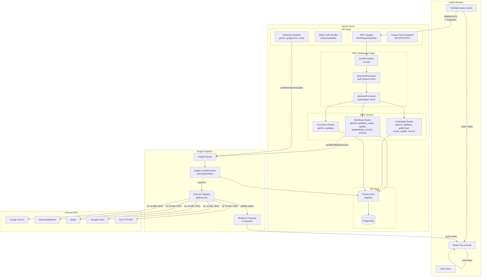
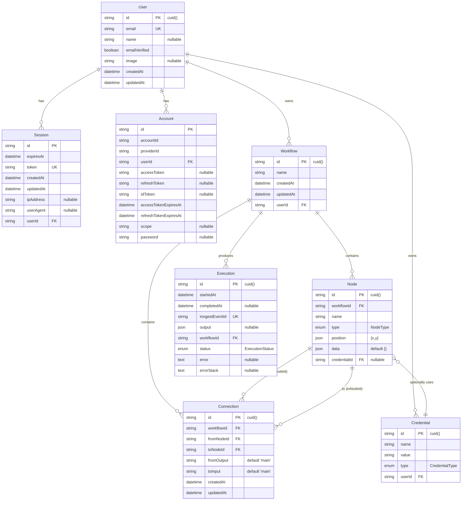
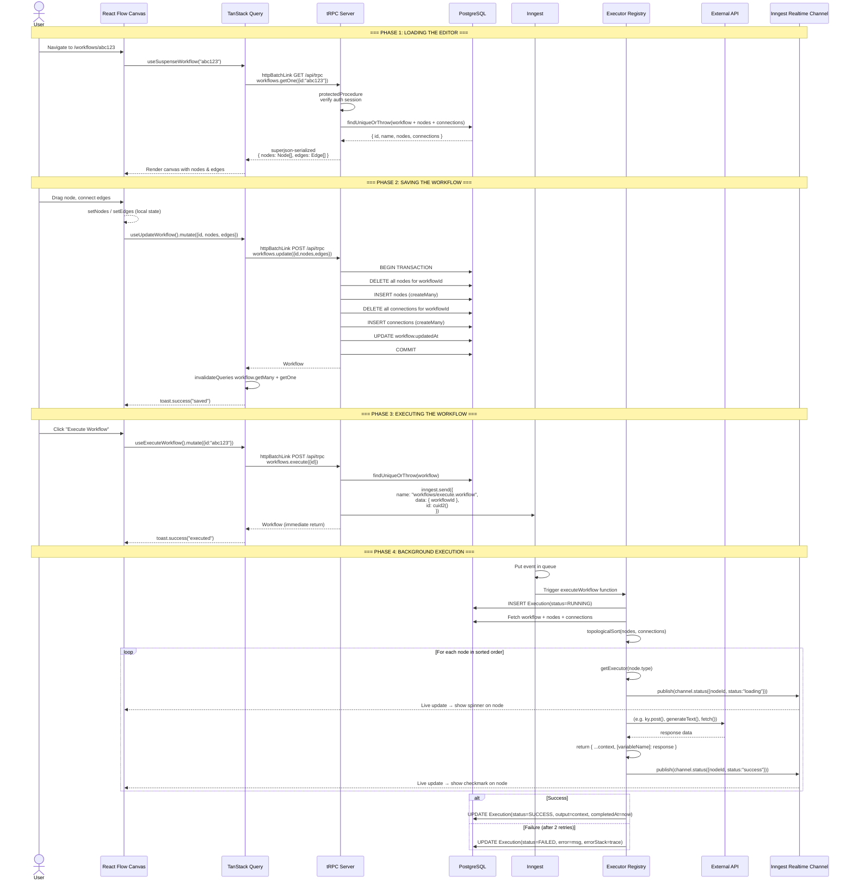
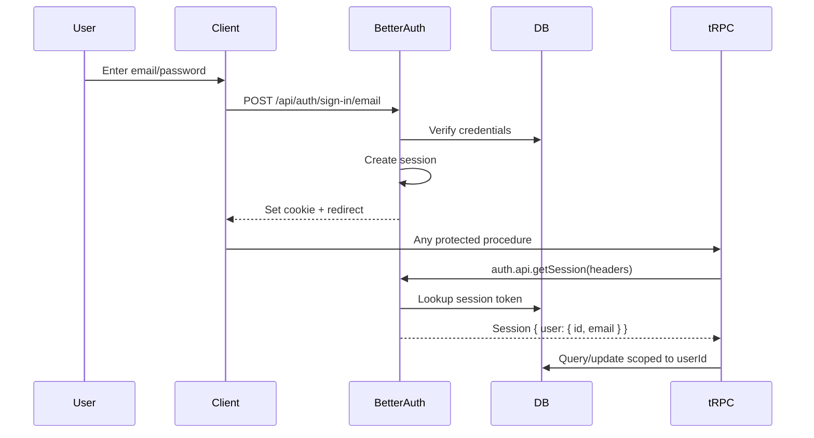
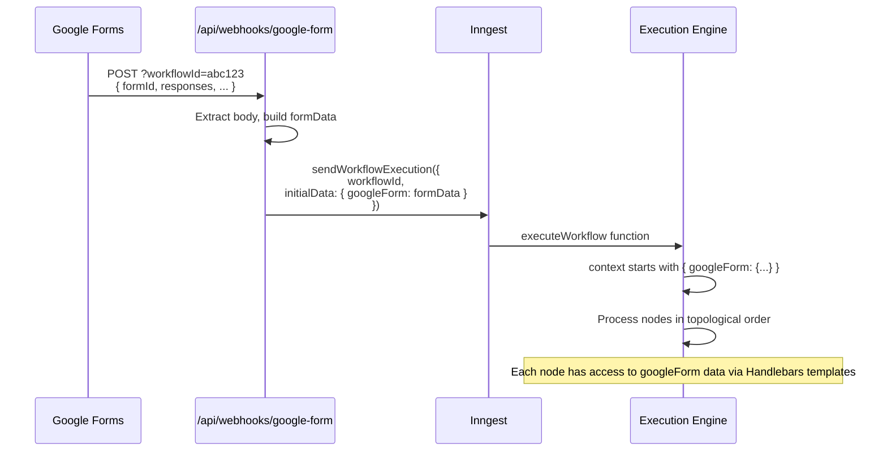

# NodeBase — Deep Architecture & Data Flow

## Table of Contents

1. [Dependency Ecosystem (Every Library & Why)](#1-dependency-ecosystem)
2. [High-Level Architecture Mermaid](#2-high-level-architecture)
3. [Database Schema Deep-Dive](#3-database-schema)
4. [tRPC: The Complete Wire — Every Procedure, Every Flow](#4-trpc-the-complete-wire)
5. [End-to-End Data Flow: Editor → tRPC → Inngest → Executor → DB → UI](#5-end-to-end-data-flow)
6. [Inngest: Background Execution Engine Deep-Dive](#6-inngest-background-execution-engine)
7. [Realtime Channels: Live Node Status in the Editor](#7-realtime-channels)
8. [Editor / React Flow Architecture](#8-editor--react-flow-architecture)
9. [Authentication & Authorization Tier System](#9-authentication--authorization-tier-system)
10. [SaaS/Billing Flow (Polar.sh)](#10-saasbilling-flow-polar)
11. [Webhook-Based Trigger Flow](#11-webhook-based-trigger-flow)
12. [Interview Questions & Answers](#12-interview-questions--answers)

---

## 1. Dependency Ecosystem

### Core Framework Layer

| Library | Version | Purpose in This Project |
|----------|---------|------------------------|
| **next** | 16.0.7 | React framework; App Router with server/client components, API routes, middleware |
| **react** / **react-dom** | 19.2.1 | UI rendering; React Server Components (RSC) for zero-JS server-rendered pages |
| **typescript** | 5.6.x | Type safety across the entire stack |

### API & Data Transport Layer

| Library | Version | Purpose |
|----------|---------|---------|
| **@trpc/server** | 11.0.0-rc.846 | Server-side tRPC: router builder, procedure definitions, middleware, context, adapters |
| **@trpc/client** | 11.0.0-rc.846 | Client-side tRPC: typed links (`httpBatchLink`), typed mutations/queries |
| **@trpc/tanstack-react-query** | 11.0.0-rc.846 | Bridge between tRPC and TanStack Query — gives us `useSuspenseQuery`, `useMutation`, prefetch, hydrate |
| **superjson** | 2.2.2 | JSON serializer that preserves Date, Map, Set, BigInt, etc. Used as tRPC data transformer so Date and BigInt survive round-trip |
| **zod** | 4.0.13 | Schema validation for all tRPC inputs; validates request bodies at the edge |
| **ky** | 1.7.2 | HTTP client used by HTTP Request node executor to make outbound API calls |

### Database Layer

| Library | Version | Purpose |
|----------|---------|---------|
| **@prisma/client** | 6.14.0 | Type-safe ORM client; generated into `src/generated/prisma/` |
| **prisma** | 6.14.0 | CLI & migration engine; schema defined in `prisma/schema.prisma` |

### Auth Layer

| Library | Version | Purpose |
|----------|---------|---------|
| **better-auth** | 1.2.8 | Full-stack auth system: email/password, OAuth (GitHub, Google), session management |
| **@polar-sh/better-auth** | (bundled) | Polar.sh plugin for Better Auth — ties auth to SaaS billing |

### Background Jobs

| Library | Version | Purpose |
|----------|---------|---------|
| **inngest** | 3.28.2 | Durable execution engine; each workflow run is an Inngest function with auto-retry, step fan-out, idempotency |
| **@inngest/realtime** | 0.13.0 | Server→client push channels; used to broadcast per-node execution status (`loading`/`success`/`error`) to the React Flow canvas in real time |

### Workflow Editor

| Library | Version | Purpose |
|----------|---------|---------|
| **@xyflow/react** | 12.10.0 | React Flow — drag-and-drop node/edge canvas; provides `<ReactFlow>`, `<Background>`, `<MiniMap>`, `useReactFlow()`, `applyNodeChanges`, `addEdge` |

### State Management

| Library | Version | Purpose |
|----------|---------|---------|
| **@tanstack/react-query** | 5.82.1 | Server-state manager; every tRPC query/mutation powers its cache, invalidation, suspense, hydration |
| **jotai** | 2.14.0 | Atomic client-state; stores the `ReactFlowInstance` reference used by the editor |
| **nuqs** | 2.7.0 | URL-search-params state; page/pagination/search stored in URL so bookmarks are shareable |

### UI Stack

| Library | Purpose |
|----------|---------|
| **tailwindcss** 4 | Utility-first CSS; PostCSS plugin |
| **@radix-ui/* (20+ packages)** | Headless ARIA-compliant primitives for dialog, dropdown, accordion, tabs, etc. |
| **shadcn/ui** (generated in `src/components/ui/`) | Composable components built on Radix + Tailwind; ~50 components |
| **lucide-react** | Icon library |
| **class-variance-authority** / **clsx** / **tailwind-merge** | Component variant pattern + className dedup |
| **sonner** | Toast notifications |
| **cmdk** | Command palette |
| **recharts** | Charting |
| **embla-carousel-react** | Carousel |

### AI

| Library | Purpose |
|----------|---------|
| **@ai-sdk/google** | Vercel AI SDK Google provider — wraps Gemini API |
| **ai** (Vercel AI SDK) | `generateText()` for structured AI calls with telemetry |

### SaaS / Billing

| Library | Purpose |
|----------|---------|
| **@polar-sh/sdk** | Polar.sh API client; customer lookup, subscription management |

### Utility

| Library | Purpose |
|----------|---------|
| **handlebars** | Template engine; used in HTTP request and Gemini node executors to render parameterized strings with `{{context.variable}}` |
| **toposort** | Topological sort library; used by the execution engine to determine node execution order |
| **@paralleldrive/cuid2** | Collision-resistant ID generation; creates Inngest event IDs and new React Flow node IDs |
| **date-fns** | Date utilities |
| **react-hook-form** | Form state management |
| **html-entities** | HTML entity decode; used by Discord executor |

### Dev / Monitoring

| Library | Purpose |
|----------|---------|
| **@sentry/nextjs** | Full-stack error monitoring; edge + server + browser configs; session replay |
| **biome** 2.2 | Linter + formatter (replaces ESLint + Prettier) |
| **mprocs** | Multiprocess runner: ngrok + inngest dev + next dev |

---

## 2. High-Level Architecture



---

## 3. Database Schema



### Enums

```
NodeType:   INITIAL | MANUAL_TRIGGER | HTTP_REQUEST | GOOGLE_FORM_TRIGGER
          | STRIPE_TRIGGER | GEMINI | DISCORD | SLACK

CredentialType: GEMINI

ExecutionStatus: RUNING | SUCCESS | FAILED
```

### Key Design Decisions

1. **`Node.data` is JSON** — Every node stores its entire configuration (endpoint, prompt, headers, etc.) in one JSON column. This makes nodes extensible without schema migrations.

2. **`Node.position` is JSON** — React Flow x/y coordinates stored as raw JSON `{x: 300, y: 200}`.

3. **Connection uses `fromOutput`/`toInput`** — Future-proofing for multi-output nodes (though currently all use `"main"`).

4. **Execution has `inngestEventId`** (unique) — Every execution is 1:1 with an Inngest event for idempotency and deduplication.

5. **`Execution.errorStack` is @db.Text** — PostgreSQL `text` type for unbounded error traces (varchar would truncate).

6. **Credentials store `value` in plain text** — In production this should be encrypted at rest.

---

## 4. tRPC: The Complete Wire

### 4.1 Initialization Stack

```
src/trpc/init.ts
    ↓
initTRPC.create({ transformer: superjson })
    ↓
baseProcedure             ← t.procedure (no middleware)
protectedProcedure        ← baseProcedure.use(checkAuthSession)
premiumProcedure          ← protectedProcedure.use(checkPolarSubscription)
```

**Auth check (`protectedProcedure`)**:
```typescript
// Calls Better Auth's getSession() with current headers
// Throws TRPCError(UNAUTHORIZED) if no session
// Enriches ctx with { auth: session }
```

**Subscription check (`premiumProcedure`)**:
```typescript
// Calls polarClient.customers.getStateExternal(userId)
// Throws TRPCError(FORBIDDEN) if no active subscription
// Enriches ctx with { customer }
```

### 4.2 Router Tree

```
appRouter
├── workflows (workflowsRouter)
│   ├── create       [mutation, PREMIUM]
│   ├── remove       [mutation, AUTH]
│   ├── update       [mutation, AUTH]
│   ├── updateName   [mutation, AUTH]
│   ├── execute      [mutation, AUTH]
│   ├── getOne       [query, AUTH]
│   └── getMany      [query, AUTH]
├── credentials (credentialsRouter)
│   ├── create       [mutation, PREMIUM]
│   ├── remove       [mutation, AUTH]
│   ├── update       [mutation, AUTH]
│   ├── getOne       [query, AUTH]
│   ├── getMany      [query, AUTH]
│   └── getByType    [query, AUTH]
└── executions (executionsRouter)
    ├── getOne       [query, AUTH]
    └── getMany      [query, AUTH]
```

### 4.3 Every Single Procedure — In Detail

#### `workflows.create` (mutation, PREMIUM)
```
INPUT:  none
FLOW:   1. generateSlug(3) → random 3-word name (e.g. "happy-green-tiger")
        2. prisma.workflow.create({ nodes: { create: { type: INITIAL, position: {x:0,y:0} } } })
OUTPUT: Workflow (with initial node)
HOOK:   useCreateWorkflow → toast.success, invalidates workflow.getMany
```

#### `workflows.remove` (mutation, AUTH)
```
INPUT:  { id: string }
FLOW:   1. prisma.workflow.delete({ where: { id, userId } })
OUTPUT: Deleted workflow
HOOK:   useRemoveWorkflow → toast.success, invalidates workflow.getMany + workflow.getOne
```

#### `workflows.update` (mutation, AUTH) — THE CRITICAL ONE
```
INPUT:   { id, nodes: Node[], edges: Edge[] }
FLOW:    1. Verify workflow ownership (findUniqueOrThrow by id + userId)
         2. BEGIN TRANSACTION:
            a. DELETE ALL existing nodes for workflowId
            b. INSERT ALL new nodes via createMany (batch)
            c. DELETE ALL existing connections for workflowId
            d. INSERT ALL new connections via createMany (batch)
            e. UPDATE workflow.updatedAt
         3. COMMIT
OUTPUT:  Workflow
DESIGN:  Full replace strategy — simpler than diff/patch
HOOK:    useUpdateWorkflow → toast.success("saved"), invalidates cache
```

#### `workflows.updateName` (mutation, AUTH)
```
INPUT:  { id, name }
FLOW:   prisma.workflow.update({ where: { id, userId }, data: { name } })
```

#### `workflows.execute` (mutation, AUTH)
```
INPUT:  { id }
FLOW:   1. Verify workflow ownership
        2. sendWorkflowExecution({ workflowId: id })
           └─> inngest.send({ name: "workflows/execute.workflow", data: { workflowId }, id: cuid2() })
        3. Return workflow (execution is async/inngest)
OUTPUT:  Workflow (NOT the execution — that happens in background)
CRITICAL: This returns immediately! Execution happens via Inngest.
```

#### `workflows.getOne` (query, AUTH)
```
INPUT:  { id }
FLOW:   1. prisma.workflow.findUniqueOrThrow({ where: { id, userId }, include: { nodes, connections } })
        2. Map DB nodes → React Flow Node[] (id, type, position, data)
        3. Map DB connections → React Flow Edge[] (id, source, target, sourceHandle, targetHandle)
OUTPUT:  { id, name, nodes: Node[], edges: Edge[] }
HOOK:   useSuspenseWorkflow(id) → useSuspenseQuery
```

#### `workflows.getMany` (query, AUTH)
```
INPUT:  { page=1, pageSize=5, search="" }
FLOW:   1. Build WHERE: { userId, name: { contains: search, mode: insensitive } }
        2. Parallel: findMany(skip, take, orderBy: updatedAt desc) + count()
        3. Compute: totalPages, hasNextPage, hasPreviousPage
OUTPUT:  { items, page, pageSize, totalCount, totalPages, hasNextPage, hasPreviousPage }
HOOK:   useSuspenseWorkflows → useSuspenseQuery with nuqs URL params
```

---

#### `credentials.create` (mutation, PREMIUM)
```
INPUT:  { name, type: GEMINI, value }
FLOW:   prisma.credential.create({ data: { name, userId, type, value } })
```

#### `credentials.remove` (mutation, AUTH)
```
INPUT:  { id }
FLOW:   prisma.credential.delete({ where: { id, userId } })
```

#### `credentials.update` (mutation, AUTH)
```
INPUT:  { id, name, type, value }
FLOW:   1. findUniqueOrThrow(id, userId)
        2. prisma.credential.update({ where: { id, userId }, data: { name, type, value } })
```

#### `credentials.getOne` (query, AUTH)
```
INPUT:  { id }
FLOW:   prisma.credential.findUniqueOrThrow({ where: { id, userId } })
```

#### `credentials.getMany` (query, AUTH)
```
INPUT:  { page=1, pageSize=5, search="" }
FLOW:   Same pagination pattern as workflows.getMany; includes `value` in response
```

#### `credentials.getByType` (query, AUTH)
```
INPUT:  { type: GEMINI }
FLOW:   prisma.credential.findMany({ where: { userId, type } })
PURPOSE: Used by Gemini node dialog to populate credential selector dropdown
```

---

#### `executions.getOne` (query, AUTH)
```
INPUT:  { id }
FLOW:   prisma.execution.findUniqueOrThrow({ where: { id, workflow: { userId } }, include: { workflow: { select: { id, name } } } })
OUTPUT:  Full execution record with nested workflow id+name
```

#### `executions.getMany` (query, AUTH)
```
INPUT:  { page=1, pageSize=5 }
FLOW:   Parallel findMany + count, filtered by workflow: { userId }
OUTPUT:  Same paginated shape, items include nested workflow { id, name }
```

### 4.4 Client-Side tRPC Setup Deep-Dive

```
TRPCReactProvider (in root layout.tsx)
  │
  ├── QueryClientProvider (TanStack Query)
  │   └── config: { staleTime: 30s, superjson serialize/deserialize }
  │
  └── TRPCProvider (from @trpc/tanstack-react-query)
      └── trpcClient: createTRPCClient({
            links: [httpBatchLink({
              transformer: superjson,
              url: "/api/trpc"  (or VERCEL_URL in prod)
            })]
          })
```

**httpBatchLink** — All tRPC calls in a microtask tick get batched into a single HTTP POST. Example: 3 parallel `getMany` queries from different components → 1 HTTP request with all 3.

**superjson transformer** — Without it, `Date`, `BigInt`, `Map`, `Set` get lost in JSON. With it, `startedAt: Date` in Execution from DB survives the round trip.

### 4.5 Server-Side tRPC Setup

```
Server Components (RSC) use:
  trpc.workflows.getOne.queryOptions({ id })  → for prefetch
  caller.workflows.create({ ... })            → for server mutations

HydrateClient component:
  Wraps children in <HydrationBoundary state={dehydrate(queryClient)}>
  So server-prefetched data lands in client cache without a network request
```

### 4.6 tRPC → TanStack Query Hook Pattern

Every hook in the codebase follows the same pattern:

```typescript
// 1. Get the typed hooks from tRPC context
const trpc = useTRPC();

// 2. Query hooks use trpc.[router].[method].queryOptions(input)
useSuspenseQuery(trpc.workflows.getOne.queryOptions({ id }));

// 3. Mutation hooks use trpc.[router].[method].mutationOptions({ onSuccess, onError })
useMutation(trpc.workflows.create.mutationOptions({
  onSuccess: (data) => {
    toast.success(`Workflow "${data.name}" created`);
    queryClient.invalidateQueries(trpc.workflows.getMany.queryOptions({}));
  },
}));
```

**Key insight**: `queryOptions()` and `mutationOptions()` are generated by `@trpc/tanstack-react-query`. They produce the exact `useQuery`/`useMutation` options TanStack Query needs, including:
- `queryKey` — auto-generated from router path + input (e.g. `[['workflows','getOne'], { input: { id: 'abc' } }]`)
- `queryFn` — auto-generated that calls `trpcClient.workflows.getOne.query({ id: 'abc' })`

---

## 5. End-to-End Data Flow: Editor → tRPC → Inngest → Executor → DB → UI



---

## 6. Inngest: Background Execution Engine Deep-Dive

### 6.1 Client Creation

```typescript
// src/inngest/client.ts
export const inngest = new Inngest({
  id: "nodebase",
  middleware: [realtimeMiddleware()]   // <-- enables realtime channels
});
```

### 6.2 The Execution Function

```typescript
// src/app/api/inngest/functions.ts
export const executeWorkflow = inngest.createFunction(
  {
    id: "execute-workflow",
    retries: 2,           // Auto-retry on failure, up to 2 retries
    onFailure: async ({ event }) => {
      // Update Execution record to FAILED
      await prisma.execution.update({
        where: { inngestEventId: event.data.event.id },
        data: { status: "FAILED", error, errorStack }
      });
    },
  },
  {
    event: "workflows/execute.workflow",
    channels: [             // Register all realtime channels
      httpRequestChannel(),
      manualTriggerChannel(),
      googleFormChannel(),
      geminiChannel(),
      discordChannel(),
    ]
  },
  async ({ event, step, publish }) => {
    // 1. Create execution record
    // 2. Topological sort nodes
    // 3. Pipe context through each node
    // 4. Update execution to SUCCESS
  }
);
```

### 6.3 Topological Sort Explained

```typescript
// src/app/api/inngest/utils.ts
function topologicalSort(nodes, connections): Node[] {
  // Step 1: Build edge list for toposort library
  const edges = connections.map(c => [c.fromNodeId, c.toNodeId]);

  // Step 2: Handle disconnected nodes
  // Nodes with no connections get a self-reference [id, id]
  // so they still appear in the sorted output
  for (const node of nodes) {
    if (!connectedNodeIds.has(node.id))
      edges.push([node.id, node.id]);
  }

  // Step 3: Run toposort
  try {
    sortedIds = toposort(edges);   // npm: toposort
    sortedIds = [...new Set(sortedIds)]; // deduplicate
  } catch (error) {
    if (error.message.includes("Cyclic"))
      throw new Error("Cyclic dependency detected");
  }

  // Step 4: Map back to Node objects
  return sortedIds.map(id => nodeMap.get(id)).filter(Boolean);
}
```

**Example**: If Node A connects to Node B, and Node B connects to Node C:
- Edges: `[['A','B'], ['B','C']]`
- Sorted: `['A', 'B', 'C']`
- Node A executes first, passes `context` to B, which passes to C.

### 6.4 Executor Contract

```typescript
// src/features/executions/types.ts
type NodeExecutor<TData> = (params: {
  data: TData;           // Node's JSON configuration
  nodeId: string;        // Current node ID for channel publishing
  context: WorkflowContext;  // Accumulated context (Record<string, unknown>)
  step: StepTools;       // Inngest step API (step.run, step.ai.wrap)
  publish: Realtime.PublishFn;  // Push realtime status updates
}) => Promise<WorkflowContext>;  // Return enriched context
```

### 6.5 How Context Accumulates

Node A (Manual Trigger) outputs: `{}`
Node B (HTTP Request, variableName="userData") outputs: `{ userData: { httpResponse: { status: 200, data: {...} } } }`
Node C (Gemini, variableName="aiResult") receives BOTH previous vars, outputs:
`{ userData: {...}, aiResult: { text: "..." } }`

This is the core pattern: **each executor merges its output into the accumulated context, which flows to the next node**.

### 6.6 Step API Usage

- `step.run("name", async () => { ... })` — Wraps work in an Inngest step. If the function crashes mid-execution, Inngest replays from the last completed step. No duplicate API calls.
- `step.ai.wrap("name", generateText, ...)` — Special AI step with telemetry recording.
- `publish(channel().status({ nodeId, status }))` — Pushes realtime updates to the client.

---

## 7. Realtime Channels

### 7.1 Architecture

Each node type has a dedicated channel with a `status` topic:

```
httpRequestChannel()  → channel "http-request-execution"  → topic "status": { nodeId, status: "loading"|"success"|"error" }
geminiChannel()       → channel "gemmini-execution"        → topic "status": { nodeId, status: "loading"|"success"|"error" }
googleFormChannel()   → channel "google-form-execution"    → topic "status": { nodeId, status: "loading"|"success"|"error" }
discordChannel()      → channel "Discord"                  → topic "status": { nodeId, status: "loading"|"success"|"error" }
manualTriggerChannel()→ channel "manual-trigger-execution"  → topic "status": { nodeId, status: "loading"|"success"|"error" }
stripeChannel()       → channel "stripe-execution"         → topic "status": { nodeId, status: "loading"|"success"|"error" }
```

### 7.2 Data Flow

```
Executor (publish) → Inngest Realtime → Client (subscribe) → useNodeStatus hook → Node UI update
```

The `use-node-status` hook in `src/features/executions/hooks/use-node-status.ts` subscribes to these channels and updates each node's visual indicator (spinner, check, error) in real time during execution.

---

## 8. Editor / React Flow Architecture

### 8.1 Component Hierarchy

```
Editor (page.tsx)
├── EditorHeader (breadcrumb, save, run)
│   └── ExecuteWorkflowButton (useExecuteWorkflow)
├── ReactFlow Canvas
│   ├── Background (grid)
│   ├── Controls (zoom, fit)
│   ├── MiniMap
│   ├── Panel (top-right): AddNodeButton → opens NodeSelector sheet
│   ├── Panel (bottom-center): ExecuteWorkflowButton (conditional)
│   ├── WorkflowNode (custom node wrapper)
│   │   ├── NodeToolbar (settings, delete)
│   │   ├── BaseNode / custom node component
│   │   └── NodeToolbar (bottom: name, description)
│   └── BaseHandle (input/output connectors)
└── NodeSelector (sheet, slide-in from right)
    ├── Trigger Nodes: Manual Trigger, Google Form, Stripe
    └── Execution Nodes: HTTP Request, Gemini, Discord
```

### 8.2 State Management in Editor

```typescript
// Local React state:
const [nodes, setNodes] = useState<Node[]>(workflow.nodes);   // From tRPC query
const [edges, setEdges] = useState<Edge[]>(workflow.edges);    // From tRPC query

// Jotai (global):
editorAtom = atom<ReactFlowInstance | null>   // Canvas reference for Save button

// tRPC mutations:
updateWorkflow.mutate({ id, nodes, edges })   // Serializes local state → DB
```

### 8.3 Node Type Registration

```typescript
// src/config/node-components.ts
export const nodeComponents = {
  [NodeType.INITIAL]: InitialNode,
  [NodeType.MANUAL_TRIGGER]: ManualTriggerNode,
  [NodeType.HTTP_REQUEST]: HttpRequestNode,
  [NodeType.GOOGLE_FORM_TRIGGER]: GooogleFormTrigger,
  [NodeType.GEMINI]: GeminiTriggerNode,
  [NodeType.STRIPE_TRIGGER]: StripeTrigger,
  [NodeType.DISCORD]: DiscordNode,
} as const satisfies NodeTypes;
```

This maps NodeType enum → React component. React Flow renders the correct component based on `node.type`.

### 8.4 Node Selector Logic

When a user clicks a node type in the selector sheet:
1. For MANUAL_TRIGGER: check if one already exists (only 1 allowed)
2. Generate a `cuid2()` ID for the new node
3. Calculate position: viewport center ± random jitter
4. Add to `nodes` state (replacing INITIAL node if it's the first real node)
5. Close the sheet

---

## 9. Authentication & Authorization Tier System

```
Tier 0: Unauthenticated    → login/signup pages only
Tier 1: Authenticated       → all protectedProcedure endpoints
Tier 2: Premium             → all premiumProcedure endpoints
```

### 9.1 Better Auth Setup

```typescript
// src/lib/auth.ts
export const auth = betterAuth({
  database: prismaAdapter(prisma, { provider: "postgresql" }),
  emailAndPassword: { enabled: true, autoSignIn: true },
  socialProviders: {
    github: { clientId, clientSecret },
    google: { clientId, clientSecret }
  },
  plugins: [polar({ /* creates customer on signup */ })]
});
```

### 9.2 Auth Flow



### 9.3 Premium Gate

```
workflowsRouter.execute     → protectedProcedure  (free)
workflowsRouter.create      → premiumProcedure    (paid)
credentialsRouter.create    → premiumProcedure    (paid)
```

If a free user tries `credentials.create`, they get:
```
TRPCError: FORBIDDEN — "Active subscription required"
```

The client intercepts this with `useUpgradeModal`:
```typescript
// src/hooks/use-upgrade-modal.tsx
if (error instanceof TRPCClientError && error.data?.code === "FORBIDDEN") {
  showUpgradeModal();
}
```

---

## 10. SaaS/Billing Flow (Polar.sh)

```
User signs up via Better Auth
    ↓
@polar-sh/better-auth plugin creates Polar customer (createCustomerOnSignUp: true)
    ↓
User clicks "Upgrade" → checkout({ productId, slug: "CodeKnight" })
    ↓
Polar Checkout → User pays → Polar webhook updates subscription
    ↓
premiumProcedure checks polarClient.customers.getStateExternal(userId)
    ↓
if (activeSubscriptions.length === 0) → FORBIDDEN
```

---

## 11. Webhook-Based Trigger Flow

### 11.1 Google Form Webhook



The crucial pattern: **`initialData` is passed as context seed**. When the workflow starts, the first node's context already contains the webhook payload.

---

## 12. Interview Questions & Answers

### Basic Level

**Q1: What is this project and what does it do?**
NodeBase is a visual workflow automation platform (an n8n alternative). Users create workflows by drag-dropping nodes on a canvas, connecting them, and the system executes them in topological order, calling external APIs, AI models, Discord webhooks, etc.

**Q2: What is the tech stack?**
Next.js 16 (App Router), TypeScript, PostgreSQL + Prisma, tRPC, Inngest, React Flow (@xyflow/react), TanStack Query, Jotai, Tailwind CSS 4 + Shadcn UI, Better Auth, Polar.sh.

**Q3: How does the frontend talk to the backend?**
VIA **tRPC** (with httpBatchLink and superjson transformer). All mutations/queries are end-to-end type-safe — the frontend calls `trpc.workflows.getOne.queryOptions({ id })` and TypeScript guarantees the input/output types from the router definition through Prisma and back.

**Q4: How is the directory structure organized?**
Feature-based. Each domain (workflows, credentials, executions, triggers, editor) has its own `features/[name]/` with `components/`, `server/`, `hooks/`. Shared UI lives in `src/components/ui/`. tRPC setup in `src/trpc/`. Inngest in `src/inngest/`.

### Intermediate Level

**Q5: Explain how a workflow execution works from button click to completion.**
1. User clicks "Execute Workflow" → calls `trpc.workflows.execute.mutate({ id })`
2. Server sends Inngest event `workflows/execute.workflow` with `workflowId`
3. Inngest function creates an `Execution` record (status: RUNNING)
4. Fetches all nodes + connections from DB, runs `topologicalSort()`
5. Iterates sorted nodes, each executor receives accumulated `context`, passes enriched context to next node
6. Each executor publishes realtime status via Inngest channels → client sees live spinner/checkmark
7. On success: updates Execution (status: SUCCESS, output: final context)
8. On failure (after 2 retries): updates Execution (status: FAILED, error, errorStack)

**Q6: How does the workflow update mutation work?**
It uses a **full-replace strategy** inside a Prisma transaction:
1. Delete all existing nodes for the workflow
2. Bulk-insert all new nodes (`createMany`)
3. Delete all existing connections
4. Bulk-insert all new connections
5. Update `workflow.updatedAt`
This is simpler than diff/patch and guarantees consistency. If any step fails, the entire transaction rolls back.

**Q7: What is the context object and how does it propagate?**
Context is a `Record<string, unknown>` that starts empty (or with `initialData` for webhook triggers). Each executor receives it, performs its operation, and returns `{ ...context, [variableName]: result }`. The next node in topological order receives the enriched context. By the final node, context contains all variables set by all previous nodes.

**Q8: How does Handlebars templating work in executors?**
Node configuration fields (endpoint URLs, prompts, message content) can contain Handlebars templates like `https://api.example.com/user/{{userData.id}}`. Before execution, `Handlebars.compile(data.endpoint)(context)` resolves these templates against the accumulated context. This lets users reference outputs from previous nodes.

**Q9: Why use Inngest instead of a simple async job queue?**
- **Durable steps**: Each `step.run()` call is persisted; if the server crashes, Inngest replays from the last completed step
- **Auto-retry**: Configurable retries (2 in this project) with backoff
- **Realtime**: Built-in push channels for live status updates
- **Telemetry**: AI step recording via `step.ai.wrap()`

**Q10: Explain the three tRPC procedure tiers.**
- `baseProcedure`: No middleware, no auth — used for public endpoints
- `protectedProcedure`: Runs `auth.api.getSession(headers)` — throws UNAUTHORIZED if no session. Enriches `ctx` with `{ auth: session }`. All workflow/credential/execution queries use this.
- `premiumProcedure`: Extends `protectedProcedure`, also calls `polarClient.customers.getStateExternal()` — throws FORBIDDEN if no active subscription. Used for `workflows/create` and `credentials/create`.

### Advanced Level

**Q11: How would you add a new node type (e.g., "Send Email")?**
1. Add `EMAIL` to `NodeType` enum in `prisma/schema.prisma`, run migration
2. Create `src/features/executions/components/email/` with:
   - `node.tsx` — React Flow node UI component
   - `dialog.tsx` — Configuration dialog (To, Subject, variableName, etc.)
   - `action.ts` — (optional) action handler
   - `executor.ts` — `emailExecutor: NodeExecutor<EmailData>` with Inngest step
3. Register executor in `src/features/executions/lib/executor-registry.ts`
4. Register React component in `src/config/node-components.ts`
5. Add entry in `NodeSelector` (`src/components/node-selector.tsx`)
6. Optionally create an Inngest realtime channel in `src/inngest/channels/`

**Q12: How does superjson help in this codebase?**
Without superjson:
- `Date` objects from Prisma become strings → need manual parsing
- `BigInt` values crash JSON.stringify
- `Map`/`Set` types are lost

With superjson as tRPC transformer:
- `Date` survives `Prisma → tRPC → TanStack Query cache → React component` as a native Date
- Custom types can be registered for serialization
- Set in both `queryClient` hydrator (`serializeData`/`deserializeData`) and `httpBatchLink` transformer

**Q13: Explain the Prisma transaction in `workflows.update` and why it's necessary.**
```typescript
prisma.$transaction(async (tx) => {
  await tx.node.deleteMany({ where: { workflowId: id } });
  await tx.node.createMany({ data: nodes });
  await tx.connection.deleteMany({ where: { workflowId: id } });
  await tx.connection.createMany({ data: edges });
  await tx.workflow.update({ where: { id }, data: { updatedAt } });
});
```
Without the transaction:
- A crash after deleting nodes but before inserting new ones → workflow has no nodes
- A crash after inserting nodes but before connections → orphan nodes with no edges
- Concurrent saves by two users could interleave

The transaction guarantees **atomicity** — either all operations succeed or none do.

**Q14: How does the application handle cyclic workflow graphs?**
The `topologicalSort` function wraps `toposort` (npm) in a try-catch. If a cycle is detected, it throws `"Cyclic dependency detected"`. This bubbles up to Inngest, which marks the execution as FAILED with the cycle error.

**Q15: What is the data flow for server-side rendering (SSR) with tRPC?**
1. Server Component calls `trpc.workflows.getOne.queryOptions({ id })` (not `useQuery` — that's client-only)
2. This creates query options: `{ queryKey: [['workflows','getOne'], { input: { id } }], queryFn: ... }`
3. `prefetch()` is called on the server, which calls `queryClient.prefetchQuery(queryOptions)`
4. The server renders, and `HydrateClient` serializes the queryClient state via `dehydrate(queryClient)`
5. On the client, TanStack Query hydrates the cache from this serialized state
6. `useSuspenseQuery(trpc.workflows.getOne.queryOptions({ id }))` returns immediately from cache — no loading spinner, no network waterfall

**Q16: How does the Polar.sh integration work with authentication?**
The `@polar-sh/better-auth` plugin is registered in Better Auth's `plugins` array. On user signup (`createCustomerOnSignUp: true`), a Polar customer record is created. The plugin exposes `checkout()` and `portal()` endpoints. The `premiumProcedure` calls `polarClient.customers.getStateExternal({ externalId: ctx.auth.user.id })` to check active subscriptions before allowing premium mutations.

**Q17: What would you change to make this production-ready?**
1. **Encrypt credentials at rest** — Currently API keys are stored as plain text
2. **Rate limiting** — Add rate-limiting middleware to tRPC procedures
3. **Node execution isolation** — Consider sandboxing executor code (currently runs in the same process)
4. **Workflow versioning** — Currently updates overwrite; no audit trail
5. **Execution timeout** — No timeout on long-running node executors
6. **Webhook authentication** — Add signature verification for Stripe/Google Form webhooks
7. **Cursor-based pagination** — Offset pagination breaks with high churn
8. **Input validation hardening** — Handlebars templates could be abused for injection; add template sanitization
9. **Cold start latency** — Serverless Inngest steps add latency; consider warm-up
10. **Monitoring dashboard** — Sentry is set up but no custom metrics

**Q18: How does the `use-workflow-params.ts` URL state pattern work?**
```typescript
// Uses nuqs to store pagination/filter state in URL search params
const [params] = useWorkflowsQueryStates();
// params = { page: 1, pageSize: 5, search: "my workflow" }
// This feeds into useSuspenseQuery(trpc.workflows.getMany.queryOptions(params))
```
The URL is the source of truth for list state. Benefits: shareable URLs, browser back/forward works, SSR can read params from URL.

**Q19: Why are node type registry and executor registry separate?**
- `nodeComponents` (`config/node-components.ts`) maps NodeType → React component for rendering on the canvas. Used by React Flow's `nodeTypes` prop.
- `executorRegistry` (`executor-registry.ts`) maps NodeType → async executor function for runtime execution. Used by Inngest function.

They serve different lifecycles (rendering vs. execution) and different contexts (client-side React vs. server-side Inngest step). Keeping them separate means you can swap the UI without touching the executor, and vice versa.

**Q20: Explain the @xyflow/react integration in depth.**
- `ReactFlow` component takes `nodes`, `edges`, `onNodesChange`, `onEdgesChange`, `onConnect`, `nodeTypes`
- `onNodesChange`: Uses `applyNodeChanges()` from @xyflow/react — handles drag, selection, deletion
- `onEdgesChange`: Uses `applyEdgeChanges()` — handles edge modifications
- `onConnect`: Uses `addEdge()` — creates new connections between handles
- `onInit`: Stores the `ReactFlowInstance` in a Jotai atom so other components (save button) can access `.getNodes()`, `.getEdges()`, `.fitView()`
- `useReactFlow()` hook in `NodeSelector`: gives access to `setNodes`, `getNodes`, `screenToFlowPosition` for placing new nodes

